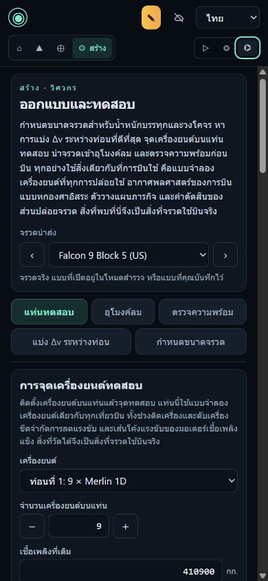
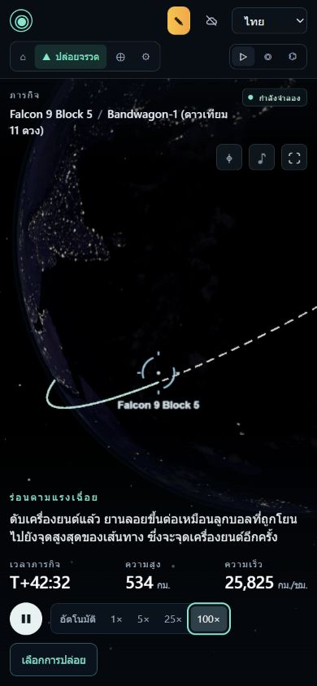

# Orbitlab — รายงานตรวจซ้ำ 28 กันยายน 2026

> **ผลตรวจรับล่าสุด 30 กันยายน:** source `4cf7e3f` ผ่าน standard **9,259/9,259 ใน 191 ไฟล์** ทั้ง PR และ push พร้อม typecheck/build; heavy **246/246 ใน 27 ไฟล์** บนฐาน numerical `0b844f7` รวมการบินอ้างอิง 21 รุ่นและ 7 บท 6-DOF อ่าน EN/TH/RU ครบข้อสอบ 157 ข้อและบทเรียน 24 บท พร้อมตรวจ case exports จริง 24 ไฟล์/18 หน้าแล้ว ดู [รายงานตรวจรับล่าสุด](../audit-2026-09-29/Orbitlab-acceptance-TH.md) และ [PR #41](https://github.com/ROYIN001/Orbitlab/pull/41) เนื้อหาเดิมด้านล่างเก็บเป็นประวัติ ไม่ใช้สถานะรอในรอบเก่าแทนผลปัจจุบัน การ merge/deploy เป็นขั้นตอนแยก

ตรวจเว็บ [Orbitlab](https://royin001.github.io/Orbitlab/) และโค้ด [main ที่ commit 0a6d1a7](https://github.com/ROYIN001/Orbitlab/tree/0a6d1a709ffbf88e8e36f606d6993bd27e5c25e0) ซึ่งรวม PR #40 แล้ว รายงานนี้เสนอการแก้ไขตามขอบเขตที่ผู้ใช้เลือก ยังไม่ได้แก้โค้ดผลิตภัณฑ์หรือเผยแพร่รุ่นใหม่

## ข้อประเมินโดยรวม

**เว็บพัฒนาไปมาก โดยเฉพาะ Build ที่ใช้งานได้จริงแล้ว และการจัดการผลคำนวณเก่าใน Orbit แต่สิ่งที่ควรทำต่อเป็นอันดับแรกคือความน่าเชื่อถือของการเรียนและการประเมินผล** ปัญหาที่พบไม่ใช่แค่ข้อความหรือความสวยงาม: ผู้เรียนยังทำคำตอบหายได้เมื่อขอคำใบ้ บางบทเรียนรับรองงานที่ไม่ตรงโจทย์ และคำถามบางข้อวินิจฉัยความเข้าใจผิดจากคำตอบที่มีเหตุผลถูกต้องได้

เหมาะให้ผู้สนใจใช้ทดลองและเรียนรู้ภายใต้ข้อจำกัดที่แสดงไว้แล้ว ส่วนการใช้คะแนนเพื่อยืนยันความสามารถหรือใช้ผลจำลองเป็นหลักฐานเชิงวิศวกรรมต้องปรับเงื่อนไขและตรวจรับเพิ่มก่อน คะแนนประเมินเชิงตัวเลขรวมจะสร้างความแม่นยำเกินหลักฐาน จึงใช้ข้อสรุปพร้อมผลทดสอบและเกณฑ์แก้แทน

## ตรวจอะไรจริงบ้าง

| ขอบเขต | หลักฐานในรอบนี้ | ข้อจำกัด |
|---|---|---|
| เว็บที่เผยแพร่ | ใช้ Launch, Orbit, Build ใน Watch / Explore / Engineer; เปลี่ยนภาษา; ทดลองบทเรียนและข้อสอบ | เป็นเส้นทางตัวแทนในแต่ละโหมด ไม่ใช่ทุกการจับคู่จรวด–ฐาน–วงโคจร–ลม–ความขัดข้อง |
| Launch | บินจรวดที่สร้างจาก Sizing; บิน Bandwagon-1 แบบ 6-DOF ถึงปล่อยดาวเทียม; Soyuz T-10-1 ถึง crew safe; ทดลอง wizard ของ Explore; ตรวจ Replay และแท็บ inspector; ส่งผลไป Orbit | ไม่ได้บินจรวดทั้ง 21 รุ่นหรือการลงจอดทุกแผน |
| Orbit | เดินทัวร์ครบ 15 ขั้น; ทดลองเมนู maneuver ทุกชนิด; Lambert/porkchop, lifetime, catalogue, overflight, conjunction, กรณี CZ-5B/NAPA-2 | ไม่ได้รับรองทุกคำตอบของตัวแก้สมการหรือความถูกต้องกับข้อมูลติดตามจริง; ไม่ได้ทดสอบอัปโหลดไฟล์ส่วนตัว |
| Build | ทัวร์ครบ 5 ขั้น; แก้และบันทึกแบบ; Static fire, Wind tunnel, Readiness, Optimal staging, Sizing; ส่งแบบไปบิน | ไม่ได้ไล่ประกอบทุกชิ้นส่วน/เครื่องยนต์ทุกคู่; วงจร import/export ทั้งหมดไม่ได้ทดสอบผ่านเบราว์เซอร์ |
| บทเรียน | อ่านโจทย์ เกณฑ์ผ่าน locks คำใบ้ และ debrief ทั้ง 24 บท EN/TH/RU; รันวิธีทำของบทเรียน point-mass ทั้ง 14 บท; ทำกรณีศึกษา 6.1–6.3 บนเว็บจนผ่าน | 7 บทที่ต้องใช้ 6-DOF อ่านโค้ดและการทดสอบวิธีทำแล้ว แต่ไม่ได้รันวิธีทำหนักครบทั้ง 7 ใหม่ |
| ข้อสอบ | ตรวจคลังครบ 157 ข้อ; อ่าน EN ครบทั้งตัวเลือก/เฉลย; เทียบโจทย์และคำตอบ TH/RU; คำนวณอิสระ 25 กลุ่มโจทย์รวม 31,639 ชุดค่า; ทดลองข้อสอบ 25 ข้อจนหน้าผลลัพธ์ | ไม่ใช่การรับรองคุณภาพข้อสอบเชิงสถิติ และไม่ได้บรรณาธิกร TH/RU ทุกประโยคอย่างอิสระ; การตอบในรอบทดสอบไม่ใช่คะแนนของเจ้าของเว็บ |
| หน้าจอเล็ก | ตรวจ Watch และ Build Engineer ภาษาไทยที่ 390×844; Build ไม่มี overflow นอกหน้าจอในเส้นทางที่ตรวจ | ใช้ viewport จำลอง ไม่ใช่อุปกรณ์จริงหลายรุ่นหรือการตรวจ screen reader เต็มรูปแบบ |

ตรวจ TypeScript ผ่าน (`tsc --noEmit`) ชุดทดสอบ Build 164 ข้อผ่าน; ชุด regression 126 ข้อผ่าน; assessment 44 ข้อและ fixture flight อีก 1 ข้อผ่าน; lesson checks 82 ผ่าน 1 ไม่ผ่านเพราะ LF/CRLF ของ fixture บน Windows ไม่ใช่การนำเข้าบทเรียนบนเว็บล้มเหลว **ไม่บวกตัวเลขเหล่านี้เป็นยอด unique tests** เพราะมีไฟล์ทดสอบร่วมกันระหว่างขอบเขต รายละเอียดคำสั่งและการข้ามทดสอบอยู่ในภาคผนวก

[CI ของ commit นี้](https://github.com/ROYIN001/Orbitlab/actions/runs/36421264575) และ [Pages deployment](https://github.com/ROYIN001/Orbitlab/actions/runs/36421217812) สำเร็จ ณ ตอนตรวจ การผ่าน CI ไม่ได้หักล้างปัญหาเส้นทางใช้งานที่ทำซ้ำได้ด้านล่าง

## รายการที่ควรแก้ก่อนเพิ่มฟีเจอร์

ระดับในรายงานนี้: **P2** = ส่งผลต่อการใช้งาน/ความเข้าใจ/การประเมินที่ควรแก้ในรอบถัดไป, **P3** = ความชัดเจนหรือการปรับปรุงรอง ไม่ได้พบเหตุให้รายงานว่าเว็บทั้งหมดใช้งานไม่ได้

| ลำดับ | ปัญหาและผลกระทบ | หลักฐาน | วิธีแก้และเกณฑ์ตรวจรับ |
|---|---|---|---|
| 1 · P2 | **คำตอบบทเรียนที่ยังไม่กด Check หายเมื่อเปิด Hint หรือเปลี่ยนภาษา** ผู้เรียนอาจเสียงานหลายช่องขณะขอความช่วยเหลือ | เว็บจริง 6.1: ใส่ `0.986` → Hint 1 → ช่องว่าง; ใส่อีกครั้ง → EN→TH → ช่องว่าง; `lesson-mode.ts:437–447,603–612,760–781` | เก็บ draft รายช่องตั้งแต่ input/change แยกจากคำตอบที่ตรวจแล้ว; คงตัวเลข ตัวเลือก และ focus เมื่อเปลี่ยนภาษา/Hint/ปิดเปิดบทเรียน |
| 2 · P2 | **เกณฑ์ผ่านบางบทไม่ยืนยันโจทย์ที่สั่ง** จึงให้สถานะผ่านกับงานคนละเป้าหมาย | บินทดสอบจริงในโมดูล: Sputnik 100 กก. ผ่านแทน 83.6; Vostok i=55° ผ่าน; Apollo apogee 330,896 กม. ผ่านแม้โจทย์ 370,000; 3.1 เปลี่ยนเป็น PEG ผ่านทั้งที่ควรเปลี่ยนได้เฉพาะ payload | ใช้ schema เดียวกำหนดคำสั่ง UI lock และ grader; แต่ละเกณฑ์ต้องมีทั้งตัวอย่างผ่านและเที่ยวบินที่ผิดเงื่อนไขนั้นโดยเฉพาะ |
| 3 · P2 | **บางข้อสอบตัดคำตอบที่มีเหตุผลถูกต้องแล้วติดป้าย misconception** | `g-zero-alpha`: ลด drag/ประหยัดเชื้อเพลิงถูกตัดว่าผิด; `c-maxq-margins`: แรงขับลดทำให้ TVC authority ลดถูกตีความว่าเชื่อเฉพาะสาเหตุนี้ | ระบุว่าถามเหตุผลเชิงโครงสร้างที่สำคัญที่สุด หรือใช้หลายคำตอบ; ห้ามอนุมานความเชื่อที่คำตอบไม่ได้กล่าว ดู A28-01 |
| 4 · P2 | **Engineer ใช้จรวดฉบับเก่าหลังแก้ Save รายการเดิม** วงจรออกแบบ–ทดสอบอาจทดสอบคนละแบบกับที่ผู้ใช้เพิ่งแก้ | เว็บจริง: บันทึก Falcon 9 แบบ 9 เครื่อง → เลือกรายการ Saved ใน Engineer → แก้เป็น 10 เครื่องและ Save → Engineer ยัง 9; `engineer-level.ts:168–185,220–227` | ผูก bench กับ record revision; เปลี่ยน revision แล้ว refresh ทุก panel และล้างผลที่ใช้แบบเก่า; ทดสอบข้าม Explore/Engineer จริง |
| 5 · P2 | **Wind tunnel รับช่อง payload ผิดรูปแต่ผลยังเหมือนใช้ได้** | เว็บจริง: `-1` ไม่ขึ้น invalid; ช่องว่างคงผลเก่า แล้วเปลี่ยนช่วงมุมกลับคำนวณใหม่จน COM เปลี่ยน 43.0→43.7 ม.; `tunnel-panel.ts:103–110,198–201,245–250` | ทุก control ผ่าน validator ชุดเดียว; input ผิดต้องมีข้อความและ clear/stale ผลอย่างชัดเจน ไม่คำนวณช่องว่างเป็นศูนย์โดยปริยาย |
| 6 · P2 | **ขอเฉลยครั้งเดียวอาจทำให้บทเรียนนั้นผ่านไม่ได้ตลอดไป** แม้ Restart | ยืนยันจาก source และ tests: revelation ถูกเก็บข้าม attempts และปิดช่องคำตอบ; กรณีศึกษามีตัวเลือกสุดท้ายคงที่ | นี่เป็นนโยบายที่โค้ดตั้งใจทำ ไม่ใช่บั๊กซ่อน: เปลี่ยนเป็น “ผ่านแบบมีความช่วยเหลือ” สำหรับ attempt นี้ แล้วให้โจทย์ค่าใหม่/กรณีใหม่สำหรับตรวจความเข้าใจเอง |
| 7 · P2 | **หน้าผลข้อสอบขัดกันเอง** บอกไม่มีเรื่องต้องทบทวน แต่ติดธงบท 1.5 ให้ทบทวน | probe seed 11: ถูก 24/25, 97%, ทุก domain strong, lesson 1.5 review แต่ `start:null`; `score.ts:148–178` | รวม explicit lesson-review flags ในคำแนะนำเริ่มเรียนและหัวข้อที่ต้องพัฒนา; ทดสอบกรณีคะแนนรวมสูงแต่พลาดพื้นฐานสำคัญ |
| 8 · P2 | **หน้าเฉลยไม่แสดงรูป/กราฟของข้อเดิม** ทำให้คำอธิบาย A/B/C หรือการอ่านกราฟขาดบริบท | source `assessment-view.ts:496–528` และเว็บจริงหน้าทบทวนไม่มีภาพประกอบของโจทย์ที่ใช้ภาพ | เก็บและ render prepared figure/ค่าที่สุ่มมาเดิมใน review; ให้บทเรียนที่เกี่ยวข้องคลิกได้; เพิ่ม accessible representation ของกราฟโดยไม่เฉลยคำตอบตรง ๆ |
| 9 · P2 | **คำเตือนบันทึกไม่สำเร็จยังไม่อยู่ใน case/assessment** และผลคะแนนเก่ายังผูกกับคลังคำถามปัจจุบัน | source: warning อยู่ catalogue/flight strip; attempts ไม่มี bank revision/snapshot | ย้าย save status ไปหัวร่วม; ก่อนแก้ลำดับตัวเลือกหรือ key ให้ตรึง question/key revision และเก็บผลตอนตรวจครั้งแรก เพื่อไม่ตีความคำตอบเก่าใหม่ |
| 10 · P2 | **บันทึกแบบใหม่อาจลบ record ที่รุ่นนี้อ่านไม่ออก** | fake-storage probe ใช้โมดูลจริง: `[d1, unreadable]` → Save d2 → `[d1,d2]`; `design-store.ts:105–113,140–157` | เก็บ raw records ที่อ่านไม่ได้หรือให้สำรองก่อนเขียน ไม่ทิ้งข้อมูลเพียงเพราะ list กรองไม่แสดง; ยังไม่พบข้อมูลของผู้ใช้สูญหายจริง |
| 11 · P2 | **ตาราง Mission result ติดป้ายเวลาคลาดความหมาย** caption บอกวงโคจร ณ เวลาที่แสดง แต่ใช้ค่า apogee/perigee จาก outcome | เว็บจริง Bandwagon: telemetry และ handoff ประมาณ 586×597 กม. แต่ตาราง 586×595; source `result-content.ts:70–75,124,168` ใช้ค่าประมาณ extrema รอบถัดไปภายใต้ J2 ที่บันทึกในเหตุการณ์สำเร็จ | แยกค่าที่ใช้ตรวจรับ ณ outcome ออกจาก osculating orbit ณ cursor; ระบุเวลาและนิยามของแต่ละชุด ไม่เอาค่าที่ใช้ตัดสินทิ้งเพียงเพื่อให้ตัวเลขตรงกัน |

ตำแหน่งไฟล์ทั้งหมดอ้างอิง snapshot ที่แนบอยู่ใน `source/` และ SHA ด้านบน รายละเอียดระดับบรรทัด/วิธีทำซ้ำครบอยู่ใน [สรุป Build](build-review.md), [บทเรียน](lessons-review.md), [ข้อสอบ](assessment-review.md) และ [source regressions](source-regressions.md)

## เนื้อหาวิชาการที่ควรแก้

| เนื้อหา | ข้อเสนอแก้ | เหตุผล/แหล่งอ้างอิง |
|---|---|---|
| บท 1.5 บอก Cape ปล่อย polar ไม่ได้และต้องบินขึ้นเหนือ | ระบุว่าเป็นข้อจำกัดทางเดินบินอย่างง่ายของ simulator หรือเพิ่ม southern dogleg | Florida กลับมาปล่อย polar ได้ในปี 2020; [Space Launch Delta 45](https://www.patrick.spaceforce.mil/News/Article-Display/Article/2889083/sld-45-to-support-multiple-southerly-trajectory-launches-in-new-year-urges-publ/) |
| `g-peg-igm` ถาม first flight ของ IGM แต่ key เป็น Saturn V ปี 1967 | เปลี่ยนเป็นการจับคู่ระบบกับตระกูลจรวด หรือแก้ประวัติ first use ให้ถูกทั้งคู่ | NASA บันทึก IGM บน Saturn I/S-IV เที่ยว SA-9 วันที่ 16 ก.พ. 1965; [รายงาน NASA](https://ntrs.nasa.gov/api/citations/19650014966/downloads/19650014966.pdf) |
| `f-series-reliability` ใช้ pⁿ โดยไม่กำหนด independence | เพิ่ม “สมมติให้แต่ละเหตุการณ์เป็นอิสระต่อกัน” ในโจทย์และเฉลยทุกภาษา | กฎคูณ marginal probability ใช้ไม่ได้ทั่วไปเมื่อเหตุการณ์สัมพันธ์กัน; สูตรในโปรแกรมถูกสำหรับกรณีอิสระ |
| `o-catch-up` ภาษาอังกฤษบอกกลับขึ้นวงโคจรด้วย “brakes back up” | เปลี่ยนขั้นกลับเป็น prograde burn เพื่อยกวงโคจร | เว็บจริงแสดงข้อความนี้; TH/RU ไม่ได้ผิดทิศแบบ EN |
| Physics & sources บอก 6-DOF ไม่มี slosh/flex | ระบุส่วนที่เปิดได้ สถานะที่เปิดอยู่ และค่าประมาณ | ขัดกับตัวเลือกในโปรแกรมและบท 4.4 ซึ่งเปิด bending และเรียน notch |
| Apollo 13 ระบุ heater wire เป็นวงจรจุดไฟ | แยก heater overheating ซึ่งทำลายฉนวนระหว่างภาคพื้น กับ fan wiring short ตอนกวนถัง | [NASA อธิบายผลสอบสวน](https://www.nasa.gov/history/50-years-ago-apollo-13-review-board-report/) |
| Hohmann เป็นคำตอบ minimum สำหรับ circular orbit ทุกคู่ | จำกัดโจทย์เป็น Hohmann/สอง impulse หรือช่วงวงโคจรที่ระบุ | ตัวเว็บเองมี bi-elliptic ที่ใช้ Δv ต่ำกว่าสำหรับอัตราส่วนรัศมีสูง |
| THEOS ผ่านเส้นศูนย์สูตรเวลาเช้าเดิม “ทุก pass” | ระบุ descending node ให้ตรงกับ worksheet | โหนดขาขึ้นและขาลงไม่ใช่เวลาเช้าเดียวกัน |
| 6.2 ถาม error% ไม่ระบุเครื่องหมาย; 6.3 ไม่ระบุกรอบมุมให้ชัด | ใส่สูตร signed error ในคำถาม และระบุมุม inertial พร้อม ω โลกเป็นข้อมูล | เว็บจริง 6.2 ค่า +4.041 ไม่ผ่าน แต่ −4.041 ผ่าน; 6.3 ตาราง ITRF ต้องแปลงความเร็วก่อนหามุม inertial |
| Vulcan ในคำอธิบายภาพเป็นสีส้ม-น้ำตาล | แก้ให้ตรงภาพที่จัดส่ง หรืออธิบายรูปทรง | ภาพจริงสีขาว/เงินและกราฟิกแดง |

แก้คำไทยและรัสเซียแบบมี glossary กลาง เช่น ท่อน/ขั้น, โทรมาตร/ข้อมูลทางไกล, การนำวิถี/การนำร่อง, ค่าเผื่อเฟส/เฟสมาร์จิน และแก้ไวยากรณ์รัสเซียรายจุดตามภาคผนวก ปัญหาเหล่านี้ไม่ได้แปลว่าการแปลทั้งชุดใช้ไม่ได้

## ประเมินแต่ละส่วนในมุมผู้ใช้

**Launch Watch:** ภาพและเรื่องเล่าระหว่างเหตุการณ์เหมาะเป็นทางเข้าสำหรับมือใหม่ Auto speed ช่วยพาข้ามช่วงรอ ส่วนการแยกผลวงโคจรและบูสเตอร์ช่วยลดความเข้าใจผิด เที่ยว Bandwagon ที่ทดลองไปถึง orbit, circularization, payload release และมีผล landing ควรเพิ่มคำชวนคิดสั้น ๆ ก่อนเหตุการณ์ เช่น “ดับเครื่องแล้วจรวดจะหยุดหรือไม่” และปุ่มดูเหตุผล/กราฟจากฉากที่เพิ่งเกิด ไม่บังคับให้ผู้เริ่มต้นเปิด Engineer ทั้งหน้า

**Launch Explore:** quick start และป้ายเป้าหมายช่วยให้ตั้งภารกิจได้ง่ายขึ้น ควรให้ผู้ใช้ทำนายก่อนเปลี่ยนตัวแปรหนึ่งค่า แล้วเก็บ baseline และผลต่างของเที่ยวบินทันที โดยเชื่อมผลที่ไม่สำเร็จกับช่วงเวลาในกราฟที่อธิบายสาเหตุได้ ไม่เพียงบอกว่าไม่ผ่าน

เส้นทาง Watch → “Plan your own mission” เปิด Explore พร้อมเที่ยวบินเดิม ผู้ใช้ต้องกด New mission อีกครั้งจึงได้ wizard ซึ่งมีข้อความอธิบายแล้ว หากปรับให้ปุ่มนี้พาไป draft ของภารกิจโดยตรงและเก็บเที่ยวบินเดิมเป็น reference จะตรงความคาดหวังกว่า ในการทดลอง quick start → Rocket → Payload → Orbit → Launch ทำงานได้ และแสดงคำอธิบาย perigee/apogee/inclination ระหว่างตั้งค่า

**Launch Engineer:** มีเครื่องมือวิเคราะห์ลึกและแสดงสมมติฐานดีขึ้นมาก เช่น linear model ไม่รวม saturation บางอย่าง และ navigation panel อธิบายเมื่อเที่ยวบินไม่ได้เปิด INS จริง แต่ชื่อเมนูมากและข้อมูลหนาแน่น ควรมี preset “อ่านวงควบคุม / ทดสอบ step / ทดลอง sensor fault” พร้อมผลที่ควรสังเกต การปรับ Auto-tune ใน attitude inspector ยังทำ synchronous search หลัง timer จึงควรย้ายไป worker ที่ยกเลิกได้; พบจาก source และ probe ไม่ใช่รายงานว่าเบราว์เซอร์ค้างหนักจริงทุกครั้ง

ทดสอบ Flight test จริงด้วย pitch step 2° ค้าง 8 วินาทีที่ T+376.3 s: rise time 0.96 s, overshoot 7.5% เทียบแบบเชิงเส้น 0.83 s และ 5.0% เว็บแสดงความต่างและสัดส่วนที่ติด limiter ได้ ทดลอง manual roll command 0.5°/s พบ measured roll เริ่มตอบสนอง 0.187°/s หลังประมาณ 2.8 s แล้วกลับ Autopilot สำเร็จ; Replay ปฏิเสธการเปลี่ยนคำสั่ง นี่เป็นการตรวจ workflow และ response ของเที่ยวบินตัวอย่าง ไม่ใช่การตรวจรับ lesson 4.3 ที่มีหน้าต่างเวลาและเงื่อนไขของตัวเอง และไม่ใช่การรับรองความแม่นยำของโมเดลเทียบฮาร์ดแวร์

**Orbit Watch:** ทัวร์ 15 ขั้นเชื่อมกลศาสตร์กับดาวเทียมจริงและเรื่องไทยได้ดี เหมาะเป็นสื่อเรียนในตัวเอง ควรเก็บความก้าวหน้าทัวร์และให้กลับเข้าขั้นเดิมได้ รวมคำศัพท์ที่คลิกดูภาพได้ เช่น apsis, RAAN, inclination

**Orbit Explore:** เมนู maneuver มีความหลากหลายและปัญหางบเชื้อเพลิงเดิมแก้แล้ว ควรเพิ่มปุ่มเตรียมฉากให้ตรงการทดลอง เช่น “เริ่มจาก GTO แล้ว circularise ที่ apogee” หรือ “เลือก GEO เพื่อทดลองสื่อสาร” เพราะการเลือกหัวข้อการใช้งานไม่ได้เปลี่ยนวงโคจรเดิมเสมอ ผู้เริ่มต้นอาจกำลังอ่านหัวข้อ GEO แต่ยานยังอยู่ที่ความสูง ISS โดยไม่ได้สังเกต

**Orbit Engineer:** การแสดง provenance, stale result และความไม่แน่นอนเป็นจุดแข็ง ข้อมูล catalogue และ re-entry ไม่ได้ถูกนำเสนอเป็นคำทำนายแน่นอน กรณี CZ-5B ทั้งสี่คำนวณได้ และ NAPA-2 แสดงตัวอย่างที่ fitted drag ให้ผลแย่กว่าประมาณรูปทรงอย่างตรงไปตรงมา ควรแยก “ข้อมูลติดตาม / แบบจำลอง / สิ่งที่ผู้ใช้กำหนด” ให้เห็นในบัตรผลเดียว และส่งออกชุด input ที่ใช้คำนวณได้

**Build Watch:** ตอนนี้มีแคตตาล็อก 21 รุ่นและทัวร์ 5 ขั้นที่ใช้งานได้จริง ไม่ใช่หน้า roadmap แบบรอบเก่า ภาพแยกชิ้นส่วนและบัตรอุปกรณ์ช่วยอธิบายได้ดี ควรมีโจทย์ทำนายง่าย ๆ เรื่องจำนวนเครื่องยนต์และการทิ้งมวล แล้วส่งต่อไป Explore

**Build Explore:** การดัดแปลงของจริงหรือประกอบจากชิ้นส่วนมีศักยภาพดึงให้กลับมาเล่นซ้ำสูง ควรเพิ่ม Undo และเทียบค่าเดิม/ค่าใหม่โดยไม่ต้องจำเอง ระบุให้ชัดว่า Save เก็บเฉพาะ “ตัวจรวด” ไม่ใช่ payload/ภารกิจทั้งหมด; probe แบบที่ payload 123 กก. เปิดกลับเป็น 11,400 กก. ซึ่งสอดคล้องสัญญา vehicle-only ปัจจุบัน แต่ขัดความคาดหวังของคนกำลังทำการทดลอง

**Build Engineer:** เครื่องมือทั้งห้าใช้งานและอธิบาย approximation ได้ค่อนข้างดี จุดที่ต้องทำให้ชัดคือ Readiness ตรวจ initial insertion ด้วย point-mass ไม่ได้รับรองวงโคจรสุดท้ายหรือ 6-DOF ของแบบนั้นทั้งหมด ในรอบทดลองสร้างยาน 1,000 กก., เพิ่ม Δv allowance 500 m/s, compute rating และผ่าน readiness แล้วบินได้ประมาณ 178×450 กม. ขณะที่เป้าหมาย 500×500 กม. ผลนี้อยู่ในขอบเขตที่ข้อความจำกัดไว้อยู่แล้ว แต่แสดงว่าป้าย Ready ควรระบุเงื่อนไขข้างชื่อและมีขั้น full-mission check เพิ่ม

**บทเรียนและข้อสอบ:** โครงสร้าง 6 tracks และข้อมูลกรณีศึกษาเป็นฐานที่ดีมาก โดยเฉพาะคำถามเปรียบเทียบ prediction/observation แต่ยังเน้นกรอกเลขหรือเปิดค่าจาก hint มากกว่าการพิสูจน์ความเข้าใจ ขั้นต่อไปควรให้ “ทำนาย → ทดลอง → อ่านผล → อธิบาย → ลองกรณีใหม่” และอย่าใช้การเปิดเฉลยเป็นทางตันถาวร

## สิ่งที่แก้แล้วและควรรักษาไว้

- แบบประเมินรักษาคำตอบ choice, numeric และ confidence เมื่อเปลี่ยนภาษาได้ในเส้นทางที่ลอง; บังคับเลือก confidence ก่อน Next สำหรับข้อ understanding แล้ว และแสดงจำนวนถูก/จำนวนถามพร้อมหลักถ่วงคะแนน
- Orbit ไม่ยอมใช้งบเมื่อ fuel มากกว่ามวลรวม และ zero-fuel ไม่สามารถ Adopt เป้าหมาย ideal ได้เหมือนเดิม; มีทางเลือก partial burn ที่แยกชัด
- เปลี่ยนเมืองใน overflight แล้วติดป้ายว่ารายการเดิมเป็นของ Bangkok; เปลี่ยน mass ใน lifetime แล้วเตือนว่าผลเดิมมาจาก input เก่า ทั้งสองยืนยันบนเว็บจริง
- Watch ไม่จบตั้งแต่ parking orbit ในเที่ยว Bandwagon ที่ทดลอง; รอ circularization และปล่อยดาวเทียม
- ส่งผล Launch → Orbit กลับไปวงโคจรของเที่ยวบินได้ แม้ก่อนหน้านั้นใช้ Real satellites อยู่
- การส่งออกเที่ยวบินบันทึก guidance/rendezvous/config ที่ใช้บินจริงแล้ว; schema round-trip ผ่านการทดสอบ
- Home/workspace restoration, เลือก Monte Carlo run โดยยกภารกิจทั้งชุด และการกันคำตอบ provider เก่าทับข้อมูลใหม่ มี source fix และ focused tests ผ่าน; ไม่เหมารวมว่าได้ทดสอบทุกเส้นทาง reload/online จริงแล้ว

## แผนพัฒนาที่เสนอให้อนุมัติเป็นรอบ

**รอบ A — ปกป้องงานผู้ใช้และความถูกต้องของผล:** draft บทเรียน, revision ของ Build bench, invalid Wind tunnel, save status ทุกหน้า, raw design preservation และ bank version ก่อนแก้คลังข้อสอบ ตรวจรับด้วย browser journey ข้ามหน้า/ข้ามภาษาและการจำลอง storage failure

**รอบ B — ทำให้บทเรียน/ข้อสอบเชื่อถือได้:** แก้โจทย์และ key ที่ผิด/กำกวม, จัด lock กับ rubric ให้ตรงกัน, เปลี่ยนนโยบาย reveal, คงรูปใน review และแก้ recommendation ขัดกัน ตรวจรับทั้งตัวอย่างถูกและตัวอย่างผิดที่เจาะแต่ละเงื่อนไข พร้อมรัน 7 บท 6-DOF ที่ยังเป็นช่องว่างของการตรวจรอบนี้

**รอบ C — เชื่อมเส้นทางการเรียนที่มีอยู่:** ปุ่มฉากตั้งต้นตามหัวข้อ, baseline/change comparison, feedback ที่พาไปกราฟหรือเหตุการณ์, Build → test → fly → return พร้อมค่าผลจริง, ส่งออก case snapshot และ experiment พร้อมที่มา

**รอบ D — ความต่อเนื่องและความแข็งแรง:** backup/restore ที่นำกลับได้จริง, attempt history, worker/cancel สำหรับ attitude tuning, cleanup เมื่อสร้าง Monte Carlo worker ได้ไม่ครบ และ browser tests สำหรับ Build workflows ที่โค้ดโมเดลทดสอบยังจับไม่ถึง

เมื่อ A–C ผ่านแล้วจึงค่อยขยาย satellite builder D06/D07 หรือเพิ่มบทเรียนใหม่ เพราะสิ่งที่มีอยู่ให้เนื้อหามากพอสำหรับทำเส้นทางเรียนที่ลึกและวัดผลได้แล้ว การเพิ่มจำนวนเมนูตอนนี้จะเพิ่มภาระอธิบายและตรวจรับเร็วกว่าคุณค่าที่ผู้เริ่มต้นได้รับ

## ภาคผนวกและหลักฐาน

- [ตารางและการวิเคราะห์บทเรียนครบ 24 บท](lessons-review.md)
- [คลังข้อสอบครบ 157 ข้อ พร้อมตำแหน่งและ flags](assessment-question-matrix.md)
- [รายละเอียดการตรวจข้อสอบและการให้คะแนน](assessment-review.md)
- [รายละเอียด Build และวิธีทำซ้ำ](build-review.md)
- [ตรวจ regression จากรอบก่อน](source-regressions.md)
- [สรุปกลุ่มงานแก้พร้อมลิงก์ตำแหน่งโค้ด](executive-findings-TH.md)
- [ผล probe เกณฑ์ผ่านบทเรียน](lesson-rubric-probes.json)
- [ผลตรวจโจทย์ตัวเลขและการสุ่มข้อสอบ](assessment-systematic-results.json)
- [หลักฐานใช้งานเว็บที่บันทึกไว้](live-evidence.json)

รายงานเป็นภาพสถานะของ commit ที่ระบุ หากมีการ push รุ่นใหม่หลังการตรวจ ต้องตรวจเฉพาะส่วนที่เปลี่ยนและเส้นทางที่เกี่ยวข้องอีกครั้ง

---

## สถานะติดตาม 29 กันยายน 2026 — ส่งต่องานตรวจละเอียดไป Codex Cloud

ตามคำสั่งล่าสุดของผู้ใช้ งานทดสอบและแก้ไขต่อจากรายงานนี้ย้ายไปเซสชั่น [Migrate Orbitlab work to Codex Cloud](https://chatgpt.com/codex/cloud/tasks/task_e_6abb010345588329b515ff6ceee01b00) แล้ว หลังผู้ใช้อนุญาตให้นำแพ็กเกจงานขึ้น branch สาธารณะสำหรับส่งต่อ

แพ็กเกจ [codex/cloud-audit-handoff-2026-09-29](https://github.com/ROYIN001/Orbitlab/tree/codex/cloud-audit-handoff-2026-09-29/docs/cloud-handoff-2026-09-29) เก็บโค้ดที่แก้/เพิ่ม 31 ไฟล์พร้อมรายงานและหลักฐานทดสอบ ณ จุดส่งต่อ เซสชั่น Cloud ยืนยัน apply-check และคืนไฟล์แก้ค้างแล้ว รายงานย่อยกับวิธีทำต่อในเครื่องอยู่ที่ [checkpoint](../audit-2026-09-29/RESUME-CHECKPOINT-TH.md)

**นี่เป็นสถานะส่งต่องาน ไม่ใช่การรับรองว่าทดสอบครบหรือแก้เสร็จแล้ว:** ณ เวลาส่งต่อ ชุด heavy/fleet ในเครื่องยังเป็นผลบางส่วนและมี 21 state fingerprint mismatches ที่ต้องตรวจสาเหตุ งานที่มอบหมายบน Cloud รวมการทดสอบให้จบ แก้บั๊ก/เนื้อหาที่ผิด ยืนยันกราฟิกด้วยภาพและการใช้งานจริง และอัปเดตรายงานผล แผนพัฒนาฟีเจอร์ใหม่ยังให้บันทึกก่อนตามขอบเขตผู้ใช้

### อัปเดตหลังตรวจสถานะและเริ่มรอบ Cloud ต่อ — 29 กันยายน 2026

- ผล Windows fleet ที่เขียนเสร็จหลังส่งต่อ: **ผ่าน 163/163 รายการ, ไม่ผ่าน 0, pending 0, success=true** ครบ 6 ไฟล์ เวลา 02:36–05:13 Europe/Moscow ใช้ 9,400.95 วินาที ดู [ผล JSON](../audit-2026-09-29/fleet-results.json) และ [log](../audit-2026-09-29/fleet-run.log) ผลนี้มาจาก base `0a6d1a7` พร้อมการแก้ค้างในเครื่อง ไม่ใช่การตรวจ commit สุดท้ายบน Cloud
- SHA-256 ของ fleet JSON ที่อ่านยืนยัน: `5a8ef14e094949c282c7e101b71fb080ec6d7b85402b25b3461f3cb5c3ac7f47`
- Heavy log ในเครื่องยังไม่มี final summary; พบ 180 passed และ 24 failed (21 numerical fingerprints และ 3 flex-golden hashes) จึงยังไม่ถือว่ารันทดสอบครบ
- Cloud รอบแรกจบหลังประมาณ 15 นาที: typecheck/build ผ่าน; focused 68/68 และ i18n/UI 28/28 ผ่าน แต่ standard suite ถูกหยุดก่อนจบ และยังไม่ได้รัน heavy/fleet ใหม่หรือ browser acceptance ครบ ไม่ได้ทำงานต่อทั้งคืน
- ส่งคำสั่งทำงานต่อในเซสชั่น Cloud เดิมแล้วและ UI แสดง **Thinking** ให้แบ่ง standard/heavy/fleet พร้อม log/JSON/exit code, ตรวจเบราว์เซอร์และกราฟิก, วิเคราะห์ failures, แก้บั๊ก และอัปเดตรายงาน ผลทดสอบหลังคำสั่งใหม่นี้ยังต้องรอหลักฐาน ไม่ถือว่าผ่านล่วงหน้า

สถานะการทำงานอาจเปลี่ยนหลังบันทึกนี้ ให้ตรวจ [เซสชั่น Cloud](https://chatgpt.com/codex/cloud/tasks/task_e_6abb010345588329b515ff6ceee01b00) สำหรับผลล่าสุด

### ตรวจสถานะรอบถัดมา — 29 กันยายน 2026 ช่วงค่ำ

Cloud แสดง `ERROR` / `Failed — An unknown error occurred`; metadata ระบุอัปเดตเมื่อ 14:48:47 UTC (17:48:47 Europe/Moscow) จึงไม่ใช่สถานะกำลังรันต่อเนื่อง ได้กด Retry และ CLI ตอบรับเป็น `PENDING` แล้ว สาเหตุของความล้มเหลวยังไม่ปรากฏรายละเอียด และยังไม่ถือว่ากู้ผลหรือทำงานสำเร็จ

ตรวจต่อหลัง Retry: UI กลับเป็น **Thinking** แล้ว หลักฐานภาพอยู่ที่ `audit-2026-09-29/cloud-retry-20260929.png`; เป็นการยืนยันว่ารอบใหม่เริ่มทำงาน ไม่ใช่การรับรองว่าทดสอบครบ

ก่อนรีเฟรช หน้าบันทึก Cloud แสดงผล standard จบอย่างน้อย 7 จาก 8 shards: shards 1, 2, 4, 6, 7 ออกด้วย exit 0; shard 3 ผ่าน 255/259 มี 4 failures ที่ `rigid-flex-golden.test.ts`; shard 5 ผ่าน 287/314 มี 27 failures ที่ `d01-fleet-fingerprint.test.ts` รวม failures ที่เห็น 31 รายการ ยังไม่ใช่ผลสรุปครบ suite และยังไม่ยืนยันสาเหตุของ hash mismatches

Log ยังแสดง regression test เรื่อง signed apsis error ที่ใช้ orbit ของเวลาที่แสดงผ่าน และมี heavy/fleet รันต่อถึงอย่างน้อย 08:53 UTC แต่ไม่มี final summary ที่ตรวจได้ในรอบนี้ ผลทั้งหมดข้างต้นเป็นหลักฐานจากหน้า log ไม่ใช่ผลที่รวมใน patch ดาวน์โหลด: `cloud-result-latest-20260929.patch` ยังเหมือนไฟล์แรกทุกไบต์ (SHA-256 `7b23bd6f75e6ba85db801789a6728d7c7ff6645162e88be1ee78ab5ee1053ce4`) ต้องกู้และตรวจ source/log/JSON จากรอบล่าสุดก่อนรับรองการแก้ไข ส่วน Windows fleet 163/163 และ heavy partial 180/24 ไม่เปลี่ยน

---

## ผลตรวจรับเพิ่มเติม 29 กันยายน 2026 — ใช้ส่วนนี้แทนสถานะเก่าข้างต้น

เนื้อหาก่อนหน้านี้เก็บไว้เป็นประวัติของแต่ละรอบ ส่วนสถานะปัจจุบันและหลักฐานอ้างอิงฉบับรวมอยู่ใน [Orbitlab-acceptance-TH.md](../audit-2026-09-29/Orbitlab-acceptance-TH.md) ที่แยก source/runtime/browser อย่างชัดเจน ยังไม่ได้ merge/deploy รุ่นตรวจรับขึ้นเว็บสาธารณะ

| พื้นที่ | ผลที่ยืนยันเพิ่มแล้ว |
|---|---|
| Regression ของ source-integrated รอบท้าย | **195/195 ผ่านใน16ไฟล์**, Node22,success=true; รวมDOCX/chartท้ายรอบ ดู `integrated-final-regressions2.json`. Buildรวมผ่าน `integrated-build-final2.log`; ไม่เรียกชุดนี้ว่าfullstandard |
| Fullstandard บนCloud | ครบ8shards: **2,542ผ่าน/2ไม่ผ่าน จาก2,544unique assertionsใน177files**. ข้อแรกเป็นtranslationkeyที่integratedแก้แล้ว อีกข้อเป็นSoyuztimeout5653ms/limit5000ms; rerunไฟล์i18n+exploreทั้งกลุ่มบนintegrated35/35ผ่าน โดยไม่เปลี่ยนassertions/timeout. เก็บผลCloudเดิม ไม่เขียนทับเป็นallgreen |
| Numerical fingerprints | ยืนยันruntime-dependent exacthash: Node24ตัวแทนSoyuzไม่ตรง, Node22sourceเดิมตรงgolden; D01เต็ม28/28และrigid-flex4/4ผ่านโดยไม่เปลี่ยนbaseline. Heavyเต็มยังรอfinalresult ไม่ใช้ส่วนนี้อ้างว่าทุกheavyผ่าน |
| Fleetและบทเรียนหนัก | fleet163/163เสร็จจริง ครอบคลุม18unique vehicles ไม่ใช่ครบ21รุ่นทุกmission; วิธีทำ7บท6-DOFผ่าน7/7แบบheadlessแล้ว แยกจากbrowserและcatalogue21รุ่น |
| Build catalogue | แจกแจง6,270body–engine pairsบวก272boundaries รวม **6,542/6,542ผ่าน**; rating2,132รายการคำนวณจบ. พบ16แบบที่GTOมากกว่าLEOจากguidance/acceptancegap จึงไม่รับรองphysicalpayloadratingทุกแบบ |
| Casesและassessmentผ่านUI | กรณีศึกษา3บทผ่าน/บันทึก/เปิดหน้าใหม่/ส่งออกจริง และสร้างworksheet/keyกลับจากfrozeninputได้. Assessmentสังเคราะห์25ข้อ:ตอบถูก5/ข้าม20,คะแนนถ่วงน้ำหนัก19%ตรงคำนวณซ้ำ; reviewคืนรูป3σ/step-response. เป็นQA-Test ไม่ใช่คะแนนเจ้าของเว็บ |
| ไฟล์และเมนู | Buildsave/export/import/invalid, Engineerrefresh, Windtunnelblank/negative, satellite6formats,CDM,referencevalid/overflowได้ตรวจUI. ชื่อcaseworksheet/keyผิดเมื่อสลับเร็วแก้แล้วและตรวจ6HTMLตรงtitleครบ |
| DOCXและกราฟิก | แก้ตัวเลือกWordแยกกลางข้อ;9regressionใหม่เคยfailก่อนแก้/รวมworksheet15ผ่านหลังแก้. FreshbrowserDOCX4179renderด้วยLibreOffice/Poppler ตรวจครบ3หน้าใบงาน+1หน้าเฉลย ตัวเลือกอยู่กับคำถามและไม่เห็นclippedtext. Launch/Orbitดาว/DPR/resize/disposalแก้พร้อมregression และตรวจภาพdesktop/mobileตัวแทน; Build42สถานะผ่านDOM ไม่อ้างpixelreviewครบ42ภาพ |

หลักฐานDOCXพร้อมhash/ภาพอยู่ใน [docx-pagination-validation-TH.md](../audit-2026-09-29/docx-pagination-validation-TH.md); exportผลจริงใน [ui-case-export-validation-TH.md](../audit-2026-09-29/ui-case-export-validation-TH.md) และ `ui-assessment-export-validation.json`. ชื่อไฟล์DOCXใหม่มีmissionepoch30ก.ย.ซึ่งเป็นเวลาจำลอง วันที่รันทดสอบจริงคือ29ก.ย.

ยังต้องรวมfinalheavy,ปิดแถวimport/export/boundaryที่ยังไม่มีผลUIและบันทึกข้อจำกัดที่เหลือ คำว่า“ผ่าน”ในตารางใช้เฉพาะขอบเขตหลักฐานแต่ละชั้น ไม่ใช่การรับรองความถูกต้องทุกค่าของsolver,landingทุกแผน,trackingจริง,อุปกรณ์จริงหลายรุ่นหรือคุณภาพข้อสอบเชิงสถิติ คลัง157ข้อมีcoverageเดิมและการแก้เฉพาะจุด แต่ไม่ได้ทำบรรณาธิกรTH/RUทุกประโยคใหม่โดยอิสระ

งานพัฒนาใหม่และนโยบาย เช่น reveal/assisted-pass, bankversion/history,backup/restoreและattempt history ยังบันทึกไว้ก่อนตามคำสั่งผู้ใช้ ไม่มีการเปลี่ยนนโยบายเหล่านี้เพื่อให้ผลทดสอบผ่าน

ตรวจเพิ่มหลังตารางนี้: TH/RUworksheetexportsพบTHDOCXมีป้ายรัสเซียปะปนเมื่อผู้ตรวจเปลี่ยนภาษาในช่วงรอภาพ แก้rendererให้ใช้ภาษาของworksheetและจับชื่อไฟล์ก่อนawaitแล้ว (focused46/46,TypeScriptผ่าน). หลังbuild4ตรวจbrowserQAFINAL4ใหม่8HTML/DOCXและrenderครบ8หน้า: ป้ายTHยังเป็นTHเมื่อเปลี่ยนUIเป็นRUระหว่างexport, TH/RUตรงภาษาและโจทย์/ตัวเลือกไม่แยกหน้า. เก็บชุดก่อนแก้แยก ไม่เรียกTHworksheetก่อนแก้นั้นว่าผ่านภาษา. หลักฐานใหม่ `browser-export-artifacts/docx-language-after/`. แก้ข้อความไทย `r-tsiolkovsky-calc` ให้g0=9.81ตรงสูตร/EN/RU; assessment+i18n47/47และcompatibility157ข้อ/25families/31,639ค่าผ่านโดยไม่เปลี่ยนคะแนน ดูสถานะรายเส้นทาง C01–C34 ล่าสุดใน [import/export checklist](../audit-2026-09-29/import-export-checklist-TH.md)

ชุดfocusedรวมล่าสุดหลังlocale/audioท้ายรอบ **259/259ผ่านใน22ไฟล์,0skip** (`integrated-final-regressions4.json`),buildรอบ4ผ่าน แทนผล195ในระดับfocusedโดยไม่บวกซ้ำ Fullstandardยังรายงานoriginal2,542/2พร้อมผลติดตามแยก และheavyยังไม่สรุปก่อนมีfinalresult

ตรวจอิสระท้ายรอบพบlesson progressผิดชนิดทำให้grade/revealเกิดTypeError ยืนยันด้วยreproducerและแก้การอ่านเฉพาะrecordเหล่านี้แล้ว: เก็บvalidlegacyไว้ พร้อมสำรองrawต้นฉบับก่อนบันทึกข้อมูลที่กู้; ถ้าสำรองไม่ได้จะไม่เขียนทับ. focusedใหม่และชุดcase/UI/historyที่เกี่ยวข้อง56/56ผ่าน,TypeScriptผ่าน ดู [progress-storage-recovery-TH.md](../audit-2026-09-29/progress-storage-recovery-TH.md). ผลนี้แยกจาก259ข้างต้น ไม่บวกรวมเป็นuniqueโดยอัตโนมัติ

### อัปเดต30กันยายน: final6และการรับช่วงCI

ผลfocusedล่าสุด **301/301ผ่านใน25ไฟล์,0skip,test/buildexit0** (`integrated-final-regressions6.json`) แทนยอดfocusedก่อนหน้าสำหรับชุดรวมนี้. แก้numericalbugที่ยืนยันด้วยRK4อิสระในKeplerใกล้e=1และLambertใกล้180°แล้ว: Kepler108/108, Lambert72คำตอบที่คืน/72residualผ่าน≤1m/1mm/s และ48nullยังแยกไว้โดยไม่อ้างว่าไม่มีคำตอบทุกสาขา ดู [solverreport](../audit-2026-09-29/solver-boundary-validation-TH.md)

C01/C04ภารกิจไฟล์จริง→URL→แท็บใหม่ตรงต้นฉบับทุก24leaf/empty-containerpathsและ46controls รวมUTCmillisecond; ใช้address-barfallback ไม่อ้างclipboardwriteผ่าน. C14นำเข้าSavedAได้9เครื่องยนต์/recordใหม่และDraftBยัง8. C11 ส่งออก Engineering Mass flow ภาษาไทยด้วย button click และ Specific impulse ด้วย Tab → Enter ได้ PNG จริงขนาด 2400×1200 ทั้งคู่ ตรวจภาพชื่อ หน่วย และเส้นกราฟแล้ว. C32ตรวจnegativegateactiveIridiumและnoflightพร้อมrevealเปิดkey/รอบไม่ผ่าน; ไม่เหมารวมgateทั้ง3caseหรือเปลี่ยนนโยบายเปิดเฉลยcaseอื่น. ผลUIทั้งหมดใช้โปรไฟล์QA ดู [checklistปัจจุบัน](../audit-2026-09-29/import-export-checklist-TH.md)

Sourceล่าสุดที่ตรวจGitคือ `0b844f77f5f0ffdeb7274642ddf74a57c2ee230b`. CIรอบก่อนhead3eff70bผ่าน9,187/9,188; failureเดียวเกิดจากarchitecturetestเข้าใจimporttypeผิด แก้ตัวตรวจแล้วทั้งไฟล์26/26ผ่านแยก. [HeavyActionsrun36631307401](https://github.com/ROYIN001/Orbitlab/actions/runs/36631307401) และCIใหม่บน0b844f7ยังรอfinalresult. **ผล7/7ของบทเรียน6-DOFเป็นผลheadlessก่อนรวมCloud;การรันใหม่บนsourceล่าสุดยังpending** ไม่เปลี่ยนผลเก่าหรือผลเริ่มงานให้เป็นผ่านรอบใหม่. FullCloudstandardเดิม2,542/2ยังเก็บแยกพร้อมclosures รายงานรวมเป็น [ฉบับ29–30กันยายน](../audit-2026-09-29/Orbitlab-acceptance-TH.md)

ผลตรวจ UI เพิ่มเติมรอบ final6: ข้อสอบแบบเลือกหลายคำตอบ เลือก period, energy และ apogee พร้อม Sure แล้วเปลี่ยน EN → TH → EN ค่า ARIA checked ก่อนและหลังตรงกัน ส่งคำตอบจริงได้ถูก 1/25 ข้อ คะแนนถ่วงน้ำหนัก 4% โดยตั้งใจข้ามอีก 24 ข้อ ดู [หลักฐาน multi](../audit-2026-09-29/browser-assessment-multi-final6.json) ผลนี้เป็น QA อีกครั้ง ไม่เขียนทับหลักฐานผลส่งออก 19% เดิม และไม่ใช่คะแนนเจ้าของเว็บ

การตรวจภาพ Build เพิ่มเติมใน final6 ปิดช่องว่างที่เดิมมีเพียง 42 สถานะ DOM: เก็บภาพหลัง animation จบและผู้ตรวจกราฟิกเปิดดูภาพต้นฉบับครบ 21 รุ่น × 2 โหมด รวม 42/42 ภาพ บน desktop 1280×720 ภาษาอังกฤษ ธีมมืด ไม่พบภาพว่าง ชิ้นส่วนที่ควรแสดงหลุดกรอบ หรือป้ายอ่านไม่ได้ในขอบเขตนี้ ดู [รายงานและหลักฐานภาพ](../audit-2026-09-29/build-visual-42-validation-TH.md) ไม่ขยายผลเป็นทุกภาษา ขนาดจอ หรือ part card

**อัปเดตผลรันใหม่ของ 7 บทเรียน 6-DOF:** GitHub Actions บน commit `0b844f7` และ worker Node 22.22.2 รันผ่าน **7/7 รายการ, exit 0** แล้ว ครบ 2.3, 2.4, 3.2 และ 4.1–4.4 ดู [result ใหม่](../audit-2026-09-29/actions-heavy-results/36631307401/collected-heavy/lessons-sixdof/result.json) พร้อม provenance/runtime/log ในโฟลเดอร์เดียวกัน จึงแทนสถานะรอของการรัน 7 บทล่าสุดในบันทึกก่อนหน้า แต่ไม่เปลี่ยน heavy ไฟล์อื่นที่ยังไม่จบให้เป็นผ่าน และไม่เรียกผล headless นี้ว่าการกดผ่าน browser ทั้ง 7 บท

ตรวจ assessment รูปแบบ vehicle เพิ่มแล้วใน final6: ภาพ Starship โหลดจริงขนาดต้นฉบับ 542×720 เลือกคำตอบแล้วเปลี่ยน EN → RU → EN ค่า radio checked คงเดิม ส่งคำตอบได้ถูก 1/25 ข้อ คะแนนถ่วงน้ำหนัก 3% โดยตั้งใจข้ามอีก 24 ข้อ หน้า review แสดงคำตอบถูกและเครดิต Hotel Pika · CC BY-SA 2.0 ดู [หลักฐาน vehicle](../audit-2026-09-29/browser-assessment-vehicle-final6.json) และ [ภาพ UI](../audit-2026-09-29/assessment-vehicle-photo-final6.jpg) ผลนี้แยกจาก QA 4% และไฟล์ผลเดิม 19% ไม่ใช่คะแนนเจ้าของเว็บ และตรวจเพียงหนึ่งภาพ ไม่ใช่ทุกภาพหรือคุณภาพข้อสอบทางสถิติ

## ติดตามล่าสุด: ปิดช่องว่างการอ่านภาษาและผล CI — 30 กันยายน 2026

Standard บน source `0b844f7` ผ่าน **9,241/9,241 รายการใน 190 ไฟล์** ทั้ง push และ PR โดยไม่บวกยอดซ้ำ มี [ผล CI พร้อม provenance](../audit-2026-09-29/actions-heavy-results/ci-final-standard-summary.json) Browser acceptance บน `9737f21` ผ่าน [4/4 เส้นทาง](../audit-2026-09-29/actions-heavy-results/browser-36634805813/audit-browser-logs/summary.md) รวม PWA offline ส่วนการบินจำลองมี [21 รุ่นจาก 22 tests](../audit-2026-09-29/actions-heavy-results/36631307401/vehicle-coverage-union.json) และ [บทเรียน 6-DOF ใหม่ 7/7](../audit-2026-09-29/actions-heavy-results/36631307401/collected-heavy/lessons-sixdof/result.json) ไม่ใช้ผล fleet163 เดิมเพียงชุดเดียวอ้างครบ 21 รุ่น และไม่หมายถึงทุกภารกิจ on target

ข้อจำกัดในภาพเดิมที่ยังไม่ได้ตรวจ TH/RU ทุกประโยค ได้ทำการอ่านความหมายใหม่ครบขอบเขตแล้ว: [ข้อสอบ 157 ข้อ](../audit-2026-09-29/editorial-audit/bank-editorial-review-TH.md) 926 triples/2,778 strings; [บทเรียน 24 บท](../audit-2026-09-29/editorial-audit/lesson-editorial-review-TH.md) 176 triples/528 strings พร้อม track labels อีก 36 strings และ [ข้อความใบงานกรณีศึกษา](../audit-2026-09-29/worksheet-case-editorial-TH.md) 99 keys/297 strings แก้เฉพาะข้อผิดพลาดแน่ชัดรวม 57 strings ใน 11 production files; AST อื่นเท่าเดิม ไม่เปลี่ยนเฉลยหรือสูตร ผล focused หลังแก้ fixture assertion ผ่าน [165/165](../audit-2026-09-29/editorial-audit/final-focused.json) พร้อม typecheck/build exit 0 และ commit ข้อความ `c146a699` ส่วน full CI ของข้อความล่าสุดกับ heavy final ให้ยึดรายงานตรวจรับหลัก ไม่ตีความผลระหว่างทางเป็นผ่านครบ

การอ่านนี้ไม่ใช่การรับรองโดยคณะบรรณาธิการมนุษย์หรือสถิติคุณภาพข้อสอบ ไม่ใช่การตอบ 157 ข้อผ่าน UI หรืออ้างตรวจข้อมูลประวัติศาสตร์ทุกค่ากับแหล่งปฐมภูมิใหม่ ผล QA ไม่ใช่คะแนนเจ้าของเว็บ ข้อจำกัดที่ยังมี เช่น อุปกรณ์จริงหลายรุ่น เสียงที่ได้ยิน screen reader ไฟล์ส่วนตัว และการเทียบข้อมูลติดตามจริง ยังคงระบุแยกจากงานที่ปิดแล้ว

**ผล heavy ปิดครบแล้ว:** [final acceptance](../audit-2026-09-29/actions-heavy-results/36631307401/final-heavy-acceptance-TH.md) ยืนยัน 246/246 assertions ใน 27 ไฟล์บน source `0b844f7`, actual workers Node 22.22.2 ทุกไฟล์ exit 0 ไม่มี missing/duplicate/skipped/failed การตรวจ ZIP อิสระตรงกับ collector บน Actions ซึ่งจบ 22:09:55 UTC วันที่ 29 กันยายน ผลนี้ปิดช่องว่างชุดหนัก รวม 21 รุ่นและ 7 บท 6-DOF แต่ MC 170 เที่ยวบินยังมี 18 สูญเสียและ 10 เข้าวงโคจรคลาดเป้าตาม baseline ที่รายงาน จึงไม่อ้างว่าทุกเที่ยวบินสำเร็จหรือรับรองฟิสิกส์จริงทั้งหมด ส่วนผลหลังข้อความล่าสุดและใบงานใหม่ให้ดูรายงานตรวจรับปัจจุบัน

**แก้สถานะส่งออกท้ายรอบ:** source `76534dc1` เปลี่ยนข้อความ EN/TH/RU จาก “Saved” เป็น “File prepared / Файл подготовлен / เตรียมไฟล์แล้ว” เพราะการสั่งดาวน์โหลดไม่ยืนยัน disk save รวมรอบข้อความ 60 strings ใน 11 ไฟล์ โดย AST ส่วนอื่นคงเดิม; focused 29/29 และ build ผ่าน แยกจากผลเนื้อหา c146 ที่ผ่าน 165/165 ดู [หลักฐานสถานะ](../audit-2026-09-29/editorial-audit/status-wording-tests.json) และ [AST ล่าสุด](../audit-2026-09-29/editorial-audit/text-only-verification.json) ไม่อ้างว่า status label คือหลักฐานว่ามีไฟล์จริง

**Full CI หลังเนื้อหาผ่านแล้ว:** PR run `36637128631` ของ `c146a699` ผ่าน 9,241/9,241 ใน 190 ไฟล์ บน Node 22.23.2 พร้อม typecheck/build ดู [ผลหลังแก้เนื้อหา](../audit-2026-09-29/actions-heavy-results/ci-c146-standard-summary.json) คงผลเดิมแยกไว้ ไม่บวกเป็นจำนวนข้อทดสอบใหม่ ส่วน `76534dc1` ที่แก้เฉพาะสถานะส่งออกมี focused 29/29 และ build แล้ว ผล full CI ติดตามในรายงานปัจจุบัน

**ปิด case exports หลังแก้ภาพจริง:** [รายงาน source 4cf7e3f](../audit-2026-09-29/worksheet-case-export-layout-TH.md) ยืนยัน actual downloads 24 ไฟล์ (3 cases × TH/RU × ใบงาน/เฉลย × HTML/DOCX), SHA ตรงทุกไฟล์ และตรวจ 12 DOCX/18 หน้าครบผ่าน หลังแก้ workbox ของ CZ-5B TH/RU กับ Iridium RU ไม่ให้แยกจากโจทย์ และป้าย 3σ ใน Iridium สองภาษาไม่ให้ทับชื่อดาวเทียม ข้อความก่อน–หลังตรงทั้ง 24 ไฟล์ ภาพ before277 เก็บเป็นความผิดพลาด ไม่เปลี่ยนคำสรุปย้อนหลังเป็นผ่าน การแก้ท้ายนี้เป็น renderer/layout ในสองไฟล์ ไม่อยู่ใน AST text-only 60 strings ถึง765 และไม่เปลี่ยน physics/ellipse/radius ตาม independent review ส่วน full CI ของ 4cf7e3f ให้ยึดสถานะล่าสุดในรายงานหลัก
