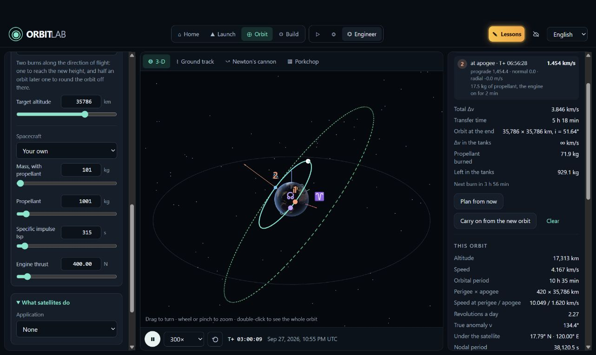
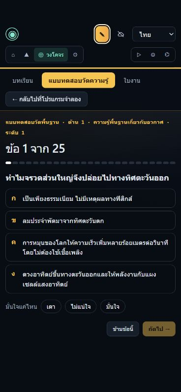

# รายงานตรวจใช้งาน Orbitlab และข้อเสนอพัฒนารอบถัดไป

ตรวจวันที่ 27 กันยายน 2026 · ตรวจเว็บจริงและอ่านโค้ด โดยไม่ได้แก้หรือเผยแพร่โค้ดผลิตภัณฑ์

เว็บ: https://royin001.github.io/Orbitlab/  
โค้ดที่ตรวจ: https://github.com/ROYIN001/Orbitlab/tree/c03f163d4d9d93a7ac361b85b9e285730041d465  
ตรวจ main ซ้ำก่อนจัดรายงาน ยังเป็น `c03f163d4d9d93a7ac361b85b9e285730041d465`  
Pages deployment ของ revision นี้สำเร็จ: https://github.com/ROYIN001/Orbitlab/actions/runs/36342043582

## ข้อสรุป

Orbitlab พัฒนาเป็นห้องทดลองการบินและวงโคจรที่มีเนื้อหาจริงแล้ว จุดเด่นที่สุดคือการเชื่อมภาพการบิน สมการ การทดลองควบคุม และบทเรียนเข้าด้วยกัน มีเหตุผลที่ผู้สนใจอวกาศและผู้เรียนวิศวกรรมจะกลับมาใช้ซ้ำ

อย่างไรก็ตาม ความสามารถของระบบเติบโตเร็วกว่าความสม่ำเสมอของประสบการณ์ใช้งาน ปัญหาสำคัญในรอบนี้คือ **การรักษาสถานะงานของผู้ใช้ และการทำให้ผลที่แสดงตรงกับค่าที่ใช้คำนวณ** หลายหน้าคำนวณได้ แต่เมื่อเปลี่ยนเมือง มวล ภารกิจ หรือโหมด ผลเก่ายังดูเหมือนเป็นผลของค่าปัจจุบัน สำหรับโปรแกรมเพื่อการศึกษา เรื่องนี้สำคัญกว่าการเพิ่มจรวดหรือเพิ่มสมการอีกชุด

คำแนะนำคือทำรอบ “แก้ความต่อเนื่องและความน่าเชื่อถือของผล” ก่อน แล้วจึงขยาย Build และเนื้อหาขั้นสูง ช่วงนี้เหมาะกับการเปิดให้ทดลองเรียนรู้ โดยยังไม่ควรเรียกว่าผ่านการตรวจรับทุกฟีเจอร์หรือใช้คะแนนทุกบทเป็นหลักฐานความชำนาญโดยไม่มีผู้สอนทบทวน

## ขอบเขตการทดลองจริง

ใช้เว็บ production ผ่านเบราว์เซอร์ในแอป ตรวจหน้าจอปกติประมาณ 1280 px และจำลอง viewport มือถือ 390 × 844 px มีทั้งการใช้ UI/แป้นพิมพ์ และ WebMCP ของเว็บสำหรับอ่านสถานะเที่ยวบินและสั่งการทดลองที่ระบุไว้ ไม่ใช่การทดสอบกับกลุ่มผู้ใช้จริงหรือโทรศัพท์จริง

| ส่วน | สิ่งที่ทดลอง | ผลและขอบเขต |
|---|---|---|
| Home / การนำทาง | เปิด Home, Launch, Orbit, Build; สลับ Watch / Explore / Engineer; reload ผ่าน Home | ทุกส่วนหลักเปิดได้ แต่พบการคืนภารกิจผิดชุด |
| Launch Watch | Soyuz เข้าวงโคจรจนมีหน้าสรุป; เลือกภารกิจใหม่; ปรับ 100×; Soyuz T-10-1 หนีไฟไหม้ฐานปล่อยจนลูกเรือถึงพื้น; Falcon 9 Bandwagon-1 จนลง LZ-1 และถึงวงโคจรเป้าหมาย | มีการบิน เหตุการณ์ คำบรรยาย และผลลัพธ์จริง; ตัวเลขการหนีภัย/ลงจอดเป็นผลแบบจำลอง ไม่ใช่การยืนยันความตรงกับประวัติศาสตร์ |
| Launch Explore | Quick start, ตั้งภารกิจ, New mission, บทเรียน 1.1, เที่ยวบิน Falcon 9 แบบ point mass จนถึงวงโคจรเป้าหมาย | ทำเส้นทางตั้งค่า → บิน → คำตอบ → ผ่านบทเรียนได้จริง |
| Launch Engineer | Falcon 9 6-DOF พร้อมเครื่องยนต์ดับที่ T+80 s; telemetry; ทุกแท็บหลักของ attitude-loop inspector; คำสั่ง doublet; Manual/Autopilot; replay | เห็นเหตุ engine-out, ผ่านการไต่ระดับไปวงโคจรพัก; replay ปฏิเสธคำสั่งแก้การบินถูกต้อง; การสลับ Manual ทดลองตอนหยุด ไม่ใช่การตรวจรับการบังคับมือเต็มภารกิจ |
| เครื่องมือวิเคราะห์ Launch | Equations, Reference frames, Help, Physics & sources, CSV, Monte Carlo | CSV สร้างข้อมูลได้ประมาณ 1.31 MB ผ่าน API ของเว็บ; Monte Carlo เริ่ม 20 runs ได้ มีผล 1 run แล้วทดสอบ Stop สำเร็จ ไม่ได้รอครบ 20 และไม่ได้สรุปความแม่นทางสถิติ |
| Orbit Watch | ทัวร์ Newton's cannon ขั้นตกกลับโลกและขั้นโคจรรอบโลก | คำบรรยายสัมพันธ์กับแบบจำลองและปุ่ม Next ใช้งานได้ |
| Orbit Explore | 3-D, Ground track, cannon, THEOS-2, Hohmann, ยานกำหนดเอง, Real satellites, ทำนายทางผ่าน | มีผลคำนวณจริง; พบเงื่อนไขมวล/เชื้อเพลิงและผลทางผ่านค้าง |
| Orbit Engineer | classical elements, Hohmann, Lambert, Porkchop, อายุวงโคจรแบบ mean elements | แสดงแผนและผลจริง; อายุวงโคจรตัวอย่างคำนวณได้ 3.0 ปี แต่ผลเดิมค้างหลังเปลี่ยนมวล |
| Build ทุกระดับ | Watch, Explore, Engineer | เป็น roadmap ทั้งสามระดับ ยังไม่มีเครื่องมือสร้างจริง และหน้าอธิบายข้อจำกัดตรงไปตรงมา |
| Lessons / placement | อ่านแคตตาล็อก 21 บท; ทำแบบทดสอบจนจบด้วยคำตอบทดสอบหนึ่งข้อและข้ามที่เหลือ; เข้าบทเรียน 1.1 บินและตอบจนผ่าน | เส้นทางแนะนำและผลผ่านทำงาน; คะแนนที่เห็นเป็นข้อมูลทดสอบ ไม่ใช่การประเมินผู้ใช้ |
| ภาษาและมือถือ | EN, TH และ RU; แบบทดสอบไทยและ Orbit รัสเซียที่ 390 px | ตัวอักษรอ่านได้ และหน้าที่วัดไม่มี overflow ทั้งเอกสาร; เมนูย่อยบางส่วนเลื่อนแนวนอน; ป้ายโหมดเหลือไอคอนจนค้นพบยาก |
| แหล่งข้อมูล | Offline → Online → Offline | หน้าแจ้งวันที่ข้อมูลและโหลดจาก NOAA/CelesTrak ได้ในการทดลองนี้; ไม่ได้ตัดเครือข่ายทดสอบ PWA แบบเต็ม |

ข้อจำกัด: ไม่ได้บินครบทุกคู่ของจรวด 21 รุ่น × ฐานปล่อย × วงโคจร × failure; ไม่ได้ทำทุกบทจนผ่าน; ไม่ได้ตรวจรับ TORU/docking, Starship entry, fleet recovery หรือ Monte Carlo 2,000 runs ครบวงจร ไม่ได้รัน test suite ทั้งโครงการใหม่ CI ที่เขียวไม่เท่ากับตรวจทุก UI journey แล้ว เพราะ heavy/fleet suites แยกจาก default suite

การดาวน์โหลดจากปุ่ม CSV ในเครื่องมือเบราว์เซอร์ไม่คืน download event ภายในเวลาที่รอ แม้ API ของเว็บสร้าง CSV ได้ จึงยังไม่รับรองการดาวน์โหลดผ่านทุกเบราว์เซอร์ ไม่จัดเป็นบั๊กยืนยันของเว็บ ปุ่มเมาส์บางครั้งไม่ตอบสนองระหว่างตรวจ แต่ใช้แป้นพิมพ์ได้และยังไม่แยกสาเหตุจากเครื่องมือ จึงไม่รวมเป็นข้อผิดพลาดยืนยันเช่นกัน ไม่ได้ตรวจคุณภาพเสียงด้วยการฟังตลอดภารกิจ

## ประเมินฟังก์ชัน ความน่าสนใจ และความเข้าใจ

| โหมด | สิ่งที่ทำได้ดี | สิ่งที่ทำให้ผู้ใช้ติดขัด | ทิศทางปรับปรุง |
|---|---|---|---|
| Watch | เข้าง่าย ภาพใหญ่ คำอธิบายช่วงบินเป็นภาษาคน มีทั้งสำเร็จและหนีภัย | หลังจบยังปล่อยเวลาเดินต่อ ภาพปลายทางบางช่วงเหลือพื้นสีเทา; การเลือกเสียง/นำเข้าเสียงทำให้เมนูเลือกภารกิจยาว | จบด้วยภาพรวมยาน/จุดลงจอด หยุดที่ผลลัพธ์สำคัญ และมี replay ไฮไลต์ 30–60 วินาที; พับตัวเลือกเสียงขั้นสูง |
| Explore | ขั้นตอน Rocket → Payload → Orbit และ quick start ช่วยเริ่มได้; คำเตือนอนุญาตให้ทดลองภารกิจที่ไปไม่ถึงเป้า | ตัวเลือกจรวด 21 รุ่นทำให้รายการยาว โดยเฉพาะเมื่อทั้งหมดถูกล็อกในบทเรียน; ผู้เริ่มต้นยังเจอความเร็วเฉื่อยบนฐานปล่อยและ perigee ติดลบ | แสดงเฉพาะสิ่งที่ต้องตัดสินใจในบทนั้น; มีตัวเลือกแนะนำ 3 แบบและ “ดูทั้งหมด”; อธิบายหน่วย/กรอบอ้างอิงติดกับค่า |
| Engineer | มีเครื่องมือที่ใช้เรียนวิศวกรรมได้จริง: loop, frequency/step response, tuning, navigation, guidance, failures, comparison | แผงยาวและมีหลายบริบทพร้อมกัน; แยกค่าภารกิจปัจจุบัน ผลเที่ยวบินเก่า และค่าทดลองได้ยาก | จัดตามงาน “ตั้งการทดลอง / บิน / วิเคราะห์ / เปรียบเทียบ”; ทุกผลมีชื่อ run และค่าต้นทาง |
| Orbit | ทัวร์ cannon, ภาพวงโคจร, Lambert และดาวเทียมไทยเป็นจุดขายที่ชัด; real satellites มีวันที่และค่าคลาดเคลื่อน | แบบแผนอุดมคติ ผลตามเชื้อเพลิง และตำแหน่งดาวเทียมจริงอยู่ใกล้กันมาก; ข้ามหน้าแล้วอาจเหลือบริบทเก่า | ป้ายประเภทผลที่เห็นชัด: “แผนคำนวณ”, “ยานทำได้จริงตามข้อจำกัด”, “ตำแหน่งจากชุดข้อมูล”; ย้ายงานพร้อมล้างบริบทที่ขัดกัน |
| Build | บอกชัดว่ายังไม่ทำ ทำให้ไม่เข้าใจผิดว่าปุ่มเสีย | อยู่ระดับเดียวกับของที่ใช้งานได้แล้ว ทั้งที่ยังไม่มีงานให้ทำ | หน้า Home แยก “ใช้งานได้” กับ “กำลังพัฒนา”; เริ่ม Build ด้วย remix จรวดหนึ่งรุ่นให้ครบวงจร |
| Lessons | 21 บทจริง 5 กลุ่ม มีโจทย์ คำใบ้ เกณฑ์ผ่าน และตัวอย่างขั้นสูง; บทแรกผ่านครบได้จริง | เนื้อหาหนักขึ้นเร็ว บางรูบริกตรวจไม่ครบงานที่สั่ง; การส่งออกไม่เก็บการทดลองครบ | เพิ่มเวลาโดยประมาณ ความรู้ก่อนเรียน และตัวอย่างผลที่ต้องอ่าน; ตรวจทั้งสิ่งที่ทำและเหตุผลที่อธิบาย |

ความน่าสนใจระยะยาวควรมาจากการได้ตั้งข้อสงสัยและเห็นผลต่าง เช่น “เพิ่มมวลอีก 2 ตันจะยังเข้าวงโคจรหรือไม่” โปรแกรมมีเครื่องมือรองรับอยู่แล้ว แต่ต้องทำให้การทดลองเป็นเรื่องราวที่ผู้ใช้ตามได้ แค่เพิ่มจำนวนเมนูจะยิ่งเพิ่มภาระการเรียนรู้

## ข้อผิดพลาดที่ทำซ้ำบนเว็บจริง

**A1 — ภารกิจที่ตั้งไว้ไม่กลับมาเมื่อ reload ผ่าน Home — ควรแก้ก่อน**

ตั้ง Quick start Falcon 9 (payload 1,000 kg) → เข้า Engineer → กลับ Home → reload → เข้า Engineer อีกครั้ง พบ Soyuz-2.1a / crew 7,150 kg แทน ภารกิจเดิมไม่ถูกนำกลับเข้าพื้นที่ทำงาน โค้ดคืน saved mission เฉพาะเมื่อเริ่มใน workspace; การแก้ครั้งถัดไปอาจเขียนทับสำเนาที่เก็บไว้ด้วย

แก้โดยแยกภารกิจผู้ใช้จากภารกิจสาธิต Watch และมี “ทำต่อจากภารกิจล่าสุด” เกณฑ์ผ่าน: เส้นทาง Home/Watch/Orbit/Build → reload → Engineer ต้องคืนค่าครบ รวม guidance, failure, seed และ payload

หลักฐาน: [main.ts L722](https://github.com/ROYIN001/Orbitlab/blob/c03f163d4d9d93a7ac361b85b9e285730041d465/src/main.ts#L722), [L1176](https://github.com/ROYIN001/Orbitlab/blob/c03f163d4d9d93a7ac361b85b9e285730041d465/src/main.ts#L1176)

**A2 — มวลเชื้อเพลิงมากกว่ามวลรวม ทำให้ Δv เป็นอนันต์ — ควรแก้ก่อน**

Orbit Engineer → Hohmann → Your own → มวลรวม 101 kg / เชื้อเพลิง 1,001 kg ระบบแสดง `∞ km/s` และเชื้อเพลิงเหลือ 929.1 kg โดยไม่มีข้อผิดพลาด ทั้งสองช่องผ่านขอบเขตแยกกัน แต่ไม่ผ่านความสัมพันธ์ทางกายภาพ

แก้ด้วยเงื่อนไข `0 ≤ propellant < total mass` พร้อมข้อความข้างช่องและไม่สร้าง budget ที่ใช้ต่อได้จนกว่าค่าจะถูกต้อง เกณฑ์ผ่าน: ไม่มี Infinity/NaN และไม่มีเชื้อเพลิงมากกว่ามวลรวมทั้งก่อนและหลัง burn

หลักฐาน: [maneuver-panel.ts L169](https://github.com/ROYIN001/Orbitlab/blob/c03f163d4d9d93a7ac361b85b9e285730041d465/src/ui/orbit/maneuver-panel.ts#L169), [budget.ts L58](https://github.com/ROYIN001/Orbitlab/blob/c03f163d4d9d93a7ac361b85b9e285730041d465/src/orbit/budget.ts#L58)

**A3 — ไม่มีเชื้อเพลิง แต่กดใช้วงโคจรปลายทางได้ — ควรแก้ก่อน**

ต่อจาก Hohmann ข้างต้น ตั้งเชื้อเพลิงเป็นศูนย์ ระบบเตือนว่าขาด 3,846 m/s แต่ปุ่ม Carry on from the new orbit ยังทำให้ยานไปอยู่ 35,786 × 35,786 km ได้ จึงเกิดเรื่องราวที่ขัดกับคำเตือนของตัวเอง

การอนุญาตให้ดูแผนอุดมคติเป็นประโยชน์ แต่ควรใช้คำว่า “ดูตัวอย่างแผนโดยไม่จำกัดเชื้อเพลิง” และแยกจากการพายานจริงไปต่อ ถ้าต้องการทดลองบินทั้งที่ไปไม่ถึง ให้คำนวณผลหลังเชื้อเพลิงหมดจริง เกณฑ์ผ่าน: โหมดที่ใช้ข้อจำกัดยานไม่ส่งมอบวงโคจรที่ไม่มีงบพอ

หลักฐาน: [maneuver-panel.ts L293](https://github.com/ROYIN001/Orbitlab/blob/c03f163d4d9d93a7ac361b85b9e285730041d465/src/ui/orbit/maneuver-panel.ts#L293), [playground.ts L649](https://github.com/ROYIN001/Orbitlab/blob/c03f163d4d9d93a7ac361b85b9e285730041d465/src/ui/orbit/playground.ts#L649)

**A4 — เปลี่ยนเมือง แต่ผล overflights ยังเป็นเมืองเดิม — ควรแก้ก่อน**

ค้นหากลุ่ม Space stations เหนือ Bangkok (สูงสุดอย่างน้อย 60°, 24 ชั่วโมง) ได้ 26 รายการ จากนั้นเลือก Moscow หัวข้อเปลี่ยนเป็น Overflights of Moscow แต่จำนวน เวลา และทิศทางในรายการยังเหมือนผลกรุงเทพฯ เช่น FREGAT DEB เวลา 23:55:12 และ CSS เวลา 00:40:01

แก้โดยจับคู่ผลกับ location, time, elevation, group และ epoch ของชุดข้อมูลทุกค่า เมื่อค่าใดเปลี่ยนให้แสดง “ค่าถูกเปลี่ยนแล้ว ต้องคำนวณใหม่” หรือคำนวณใหม่อัตโนมัติ เกณฑ์ผ่าน: ไม่มีรายการเมือง A อยู่ใต้หัวข้อเมือง B โดยไร้คำเตือน

หลักฐาน: [sky-panel.ts L484](https://github.com/ROYIN001/Orbitlab/blob/c03f163d4d9d93a7ac361b85b9e285730041d465/src/ui/orbit/sky-panel.ts#L484)

**A5 — อายุวงโคจรเก่าค้างหลังเปลี่ยนสมมติฐาน**

คำนวณวงโคจรประมาณ 498 × 504 km ที่มวล 101 kg / หน้าตัด 2 m² ได้ re-entry 3.0 ปี จากนั้นเปลี่ยนมวลเป็น 10,001 kg ผล 3.0 ปียังอยู่ใต้ชุดค่าปัจจุบัน โดยไม่ระบุว่ามาจากค่าเก่า ปัญหาไม่ได้อยู่ที่การมีปุ่ม Run แต่คือการขาดความสัมพันธ์ที่ชัดเจนระหว่างผลกับอินพุตของรอบนั้น

เก็บสำเนาอินพุตและวันที่ข้อมูลไว้กับผล แสดงสถานะผลเก่าอย่างเด่นชัด และล็อกหรือ snapshot อินพุตตอนเริ่ม worker ใช้แนวทางเดียวกันกับ re-entry, passes, conjunctions, Monte Carlo และ tuning

หลักฐาน: [lifetime.ts L104](https://github.com/ROYIN001/Orbitlab/blob/c03f163d4d9d93a7ac361b85b9e285730041d465/src/ui/lifetime.ts#L104), [L178](https://github.com/ROYIN001/Orbitlab/blob/c03f163d4d9d93a7ac361b85b9e285730041d465/src/ui/lifetime.ts#L178)

**A6 — Continue in Orbit พาไปหน้าที่ไม่แสดงยานที่เพิ่งส่งต่อ**

เคยเปิด Orbit → Real satellites ไว้ แล้วทำ Launch บทเรียน 1.1 จนสำเร็จ จากนั้นกด Continue in Orbit ระบบกลับไปแสดง ISS ใน Real satellites ต้องกด Your orbit เองจึงเห็นวงโคจร CubeSat ที่ส่งมา ข้อมูลส่งต่ออยู่จริง แต่หน้าที่เปิดไม่ใช่สิ่งที่ผู้ใช้คาดหวัง

เกณฑ์ผ่าน: ปุ่มนี้เปิด Your orbit, แสดงชื่อยานและวงโคจรจากเที่ยวบินนั้นทันที และล้างคำอธิบาย satellite/application เก่าที่ไม่ตรงกับยานใหม่

หลักฐาน: [main.ts L775](https://github.com/ROYIN001/Orbitlab/blob/c03f163d4d9d93a7ac361b85b9e285730041d465/src/main.ts#L775), [playground.ts L300](https://github.com/ROYIN001/Orbitlab/blob/c03f163d4d9d93a7ac361b85b9e285730041d465/src/ui/orbit/playground.ts#L300)

**A7 — สลับภาษาแล้วคำตอบที่ยังไม่ส่งหาย**

เลือกคำตอบและ Sure ในข้อ 1 ของ placement test ภาษาอังกฤษ จากนั้นเปลี่ยนเป็นไทย ข้อเดิมยังอยู่ แต่คำตอบไม่ถูกเลือกแล้ว และปุ่มถัดไปกลับเป็น disabled คำตอบที่ส่งไปแล้วไม่ได้เป็นประเด็นนี้

เก็บ draft answer/confidence แยกจาก DOM และเปลี่ยนเฉพาะข้อความ เกณฑ์ผ่าน: EN → TH → RU คงค่าคำตอบและ confidence รวมถึงคำตอบตัวเลขที่ยังพิมพ์ไม่เสร็จ

หลักฐาน: [assessment-view.ts L122](https://github.com/ROYIN001/Orbitlab/blob/c03f163d4d9d93a7ac361b85b9e285730041d465/src/ui/lessons/assessment-view.ts#L122), [L223](https://github.com/ROYIN001/Orbitlab/blob/c03f163d4d9d93a7ac361b85b9e285730041d465/src/ui/lessons/assessment-view.ts#L223)

**A8 — ข้อความบางส่วนยังอธิบายรุ่นเก่า**

- Physics & sources บอกว่า 6-DOF ไม่มี slosh/structural flexibility แต่ระบบมีตัวเลือกเหล่านี้และบทเรียน 4.4 ใช้ bending แล้ว ควรแยก “ค่าเริ่มต้นเป็น rigid body” กับ “เปิดแบบจำลองเสริมได้”
- หน้า Home ติด In development ให้ Orbit เช่นเดียวกับ Build ทั้งที่ Orbit ใช้ได้มากแล้ว ควรบอกว่าอะไรพร้อมใช้และอะไรยังอยู่ในแผน
- หน้าดาวเทียมไทยยังบอกว่าการติดตาม real satellites จะมาในระยะต่อไป ทั้งที่มีปุ่ม Real satellites อยู่แล้ว
- ในเที่ยวบินหนีภัยที่ลงพื้นแล้ว หน้า Equations แสดง No air to act on at this height ทั้งที่บรรทัดบรรยากาศมีความหนาแน่นราว 1.21 kg/m³ ควรแยก “ไม่มีอากาศ”, “ความเร็วสัมพัทธ์เป็นศูนย์” และ “ไม่มีข้อมูลแรงในเฟรมนี้”

เกณฑ์ผ่าน: ข้อความ EN/TH/RU อ้างอิงสถานะและความสามารถปัจจุบันเดียวกัน ตรวจทั้งกรณีบนฐานปล่อย กลางอากาศ ในอวกาศ และหลังลงพื้น

หลักฐานข้อความข้อจำกัด: [en.ts L581](https://github.com/ROYIN001/Orbitlab/blob/c03f163d4d9d93a7ac361b85b9e285730041d465/src/i18n/en.ts#L581)

**A9 — Watch เรียกวงโคจรพักว่า Mission accomplished ก่อนถึงเป้าหมายสุดท้าย**

Falcon 9 Bandwagon-1 ลง LZ-1 ที่ประมาณ T+07:42 (แบบจำลองบันทึกความเร็วลง 2.93 m/s และพลาดจุด 2 m) จากนั้นเข้าวงโคจรพักประมาณ 200 × 588 km ที่ T+07:59 หน้า Watch ฉลอง Mission accomplished และค้างคำอธิบายความสูง 200 km แม้ยังต้อง circularise จนถึงประมาณ 586 × 595 km ที่ T+53:58 การบินดำเนินต่อและถึงเป้าหมายจริง แต่ข้อความจบก่อนงานทั้งหมดจบ

นี่เป็นปัญหาความหมายของผลที่ผู้ใช้เห็น ไม่ใช่หลักฐานว่าตัวแก้สมการหยุดที่วงโคจรพัก ควรใช้การ์ด milestone “เข้าวงโคจรพักแล้ว — เหลือจุดเครื่องอีกครั้ง” และสรุปแยก payload delivery / booster recovery / rendezvous โดยใช้สถานะปลายทางจริง

หลักฐาน: [watch-logic.ts L323](https://github.com/ROYIN001/Orbitlab/blob/c03f163d4d9d93a7ac361b85b9e285730041d465/src/ui/watch-logic.ts#L323) และ event log ใน `live-evidence.json`

## ข้อค้นพบจากโค้ดที่ควรแก้และทดสอบเจาะจงต่อ

รายการนี้แยกจากบั๊กที่ทำซ้ำผ่าน UI ข้างต้น ไม่ได้อ้างว่าได้จำลองทุก trigger บนเว็บแล้ว

| เรื่อง | เหตุผลที่สำคัญ | หลักฐานและเกณฑ์แก้ |
|---|---|---|
| เปิดจุด Monte Carlo แล้วอาจได้คนละภารกิจ | ส่งกลับเฉพาะ dynamics แล้วประกอบกับ mission ปัจจุบัน ถ้าแก้ payload/vehicle/target หลัง run จะ replay ผลเก่าไม่ตรง | `src/ui/monte-carlo.ts:638`, `src/main.ts:429`; คืน full mission snapshot ของ run และทดสอบแก้ค่าระหว่าง/หลังคำนวณ |
| Export ผลบทเรียนไม่เก็บ “ภารกิจที่บินจริง” ครบ | เขียน `guidanceOverrides: {}` และไม่ใส่ rendezvous การตรวจงานย้อนหลังของบท guidance/docking จึงขาดค่าที่ใช้ | `src/ui/lessons/lesson-mode.ts:276`; serialize config จริงทั้งหมดและทดสอบ round trip ของบท 2.x/5.2 |
| เกณฑ์ผ่านบางบทตรวจไม่ครบโจทย์ | Monte Carlo สั่ง 20 runs และเลือก worst perigee แต่ hook ตรวจ dispersion/seed; step test ไม่ตรวจครบ amplitude/duration/time ที่โจทย์ระบุ | `src/lessons/hooks.ts:62`, `src/lessons/measures.ts:72`; บันทึกหลักฐานการทำแต่ละขั้นและทดสอบวิธีลัดที่ต้องไม่ผ่าน |
| Confidence เปลี่ยนคะแนนโดยผู้ใช้เห็นไม่ชัด | Guess ได้ครึ่งคะแนน แต่ไม่เลือก confidence กลับใช้ค่า unsure; ควรแยกความถูกต้องกับความมั่นใจ | `assessment-view.ts:371`, `score.ts:12`; แสดงจำนวนข้อจริงและหลักให้คะแนน หรือให้ confidence ใช้วินิจฉัยอย่างเดียว |
| เปลี่ยน Online/Offline ระหว่างโหลดอาจรับคำตอบจากคำขอเก่า | การโหลดไม่มี generation/abort guard ครบ และ cache ผลวิเคราะห์ไม่ผูก epoch ทุกกรณี | `src/ui/orbit/sky-panel.ts:132`; รับเฉพาะ response ของ provider/run ปัจจุบันและ invalidate ผลเก่า |
| Re-entry และ propagation failure อาจแสดงค่าเก่าเหมือนปัจจุบัน | อินพุตเปลี่ยนระหว่าง await; propagation ล้มเหลวแล้วบาง readout ไม่ถูกล้าง | `sky-panel.ts:597`, `:628`, `:911`; immutable inputs และสถานะ unavailable ที่มองเห็นได้ |
| Auto Tune ใน inspector ยังทำงานบน main thread | `setTimeout` เลื่อนเวลาเริ่ม แต่ไม่แบ่งงานหนักระหว่างคำนวณ ต่างจาก launch pitch tuner ที่ย้าย worker แล้ว | `src/ui/loop-tuning.ts:185`; ใช้ worker, progress, cancel; microcheck ของ routine จริง 16 model เล็กใช้ 224.7 ms ไม่ใช่ผล benchmark มือถือ |
| Monte Carlo เริ่ม worker ได้บางส่วนแล้วล้มเหลว อาจเหลือ worker ที่หยุดไม่ได้ | constructor ไม่ cleanup worker ก่อนหน้าถ้าตัวถัดไปสร้างไม่สำเร็จ | `src/physics/monte-carlo-job.ts:64`; mock failure ที่ตัวที่สองพบ posted 1 / terminated 0; ต้อง terminate ทุกตัวและรายงาน error ครั้งเดียว |
| บันทึกความก้าวหน้าล้มเหลวแล้วเงียบ | storage failure ถูก catch โดยไม่มีสถานะบอกผู้ใช้; export ผลยังไม่เท่ากับ restore ความก้าวหน้า | `src/lessons/progress.ts:55`; แจ้ง “บันทึกไม่ได้” และมี backup/restore ที่ตรวจ schema |

รายละเอียดพร้อมตำแหน่งบรรทัดอยู่ใน `code-review.md`, `orbit-review.md`, `learning-review.md` ในโฟลเดอร์รายงานเดียวกัน

## ไอเดียพัฒนาที่ให้ประโยชน์สูง

**1. สมุดการทดลองที่สร้างจากสิ่งที่มีอยู่แล้ว**

ให้ทุกการทดลองมี 5 ขั้น: ตั้งสมมติฐาน → เที่ยวบินอ้างอิง → เปลี่ยนหนึ่งค่า → เทียบผล → อธิบายเหตุผล บันทึกค่าที่เปลี่ยน กราฟที่เกี่ยวข้อง และผลต่างอัตโนมัติ เช่น “payload +2 t ทำให้ perigee ลดเท่าใด” ใช้ recorder/compare/report ที่มีอยู่ได้ ไม่จำเป็นต้องเริ่มระบบใหม่ทั้งหมด

**2. เส้นทางเริ่มต้นแยกตามผู้ใช้**

- ผู้มาใหม่: Watch 3 นาที → ตอบคำถามหนึ่งข้อ → ลองเปลี่ยนมวลใน Explore → อ่านผลสั้น ๆ
- ผู้เรียน: เลือกเป้าหมายการเรียน → บทแนะนำ → ใบงานและคำใบ้ → อธิบายผล → export ให้ผู้สอน
- ผู้เรียนวิศวกรรม: โหลด baseline → เปลี่ยน control/navigation/fault → รันซ้ำด้วย seed เดิม → เทียบ margins/accuracy → สรุปข้อจำกัด

ไม่ควรบังคับทำข้อสอบ 25 ข้อก่อนใช้ ให้เลือก “เริ่มเลย” และเสนอแบบทดสอบเมื่อผู้ใช้ต้องการเส้นทางที่เหมาะกับตน

**3. ผลสรุปที่บอกเหตุและขั้นถัดไป**

เมื่อไม่สำเร็จ ให้ชี้เหตุหลักจากข้อมูลจริง เช่น “วงโคจรไม่ถึงเพราะหมดเชื้อเพลิงก่อน circularisation” พร้อมปุ่ม replay ช่วงนั้น และเสนอการทดลองหนึ่งอย่าง หลีกเลี่ยงคำแนะนำกว้าง ๆ ที่ไม่ได้สัมพันธ์กับ flight log หากยังวินิจฉัยเหตุไม่ได้ให้บอกว่าต้องตรวจอะไรต่อ

**4. Mission challenges ที่มีบริบทไทย**

ตัวอย่างโจทย์: ให้ดาวเทียมผ่านกรุงเทพฯ ในช่วงกลางวัน, ทำให้ตำแหน่ง GEO อยู่เหนือภูมิภาคที่กำหนด, สำรวจความสัมพันธ์ความสูง–swath–resolution, เปรียบเทียบ THEOS กับดาวเทียมสื่อสาร สิ่งนี้ทำให้ผู้ใช้เข้าใจว่าคณิตศาสตร์ใช้ทำอะไร และใช้ข้อมูลสาธารณะที่ระบบมีอยู่แล้ว

**5. อธิบายศัพท์และหน่วย ณ จุดใช้งาน**

คำย่อ RAAN, Δv, max-Q, PEG, IGM, phase margin ควรมีคำอธิบายหนึ่งประโยคพร้อมภาพหรือ highlight ค่าที่เปลี่ยน ไม่ต้องเปิดเอกสารยาวทุกครั้ง ทำ glossary TH/EN/RU ให้คำแปลสม่ำเสมอ ใช้คำมาตรฐานพร้อมศัพท์ต้นฉบับได้ โดยไม่ยัดทุกภาษาในทุกป้าย

**6. ช่วยมองเห็นเหตุการณ์สำคัญ**

ปุ่ม “ดู staging”, “ดู max-Q”, “ดูช่วงผิดพลาด”, “ดู landing” เรียกช่วง replay และมุมกล้องที่เหมาะสม เพิ่มเส้นทางและลูกศรแรงแบบเปิดได้ พร้อมบอกเมื่อภาพขยายขนาดยานเกินสเกลจริง Watch ควรมีภาพจบที่อ่านออกและปุ่มทดลองเหตุการณ์เดียวกันด้วยค่าต่างกัน

**7. ทำมือถือให้เลือกทำงานทีละอย่าง**

แบบทดสอบไทยที่ 390 px อ่านได้ดี แต่ Engineer และ Orbit มีข้อมูลมาก ควรมีแท็บงาน “ตั้งค่า / ดูภาพ / ผล” และปุ่มหลักที่อยู่ใกล้นิ้ว โหมดที่ไม่ได้เลือกควรมีชื่ออ่านได้อย่างน้อยในเมนูขยาย ปรับค่าหนึ่งตัวแล้วกลับภาพเดิมได้ ไม่ต้องเลื่อนผ่านตัวเลือกที่ไม่ได้ใช้งานซ้ำ

**8. Build รุ่นแรกควรทำให้ครบวงจรในขอบเขตเล็ก**

เริ่มจาก remix จรวดที่มีอยู่: เปลี่ยนมวลบรรทุก ขยายถัง เลือกเครื่องยนต์จากชุดจำกัด แล้วดู dry mass, T/W, Δv, center of mass และคำเตือน ก่อนส่งไป Launch ได้จริง ให้ภารกิจที่สร้างกลับมาแก้และแชร์ได้ จากนั้นจึงเพิ่มออกแบบดาวเทียมและ optimal staging การทำ builder หลายระบบพร้อมกันจะเพิ่มภาระข้อมูลและการตรวจรับอย่างมาก

**9. เพิ่มความพร้อมใช้ในชั้นเรียน**

ผู้สอนแจกไฟล์โจทย์ที่ล็อกค่าจำเป็น ผู้เรียนส่งไฟล์ผลที่มี run/config/version/seed ครบ มี backup/restore ความก้าวหน้า และโหมดนำเสนอที่เน้นกราฟเดียว ระบบ offline ที่มีอยู่เป็นข้อได้เปรียบ ควรต่อยอดก่อนเพิ่มบัญชีผู้ใช้หรือระบบออนไลน์ที่ไม่จำเป็น

## ลำดับงานที่เสนอและเกณฑ์จบ

| ลำดับ | งาน | เกณฑ์จบที่ตรวจได้ |
|---|---|---|
| 1 — ความถูกต้องและรักษางานผู้ใช้ | A1–A6, full run snapshot, lesson export | ไม่มีผลเก่าภายใต้ค่าใหม่โดยไม่เตือน; ภารกิจกลับมาครบหลัง reload; ไม่มี infinite budget หรือส่งยานไร้เชื้อเพลิงถึงเป้าในโหมดจริง |
| 2 — คำอธิบายและการเรียน | A7–A9, grading contract, score/confidence, glossary | เปลี่ยนภาษาไม่ล้างคำตอบ; เอกสารตรงกับ option ที่เปิดจริง; ทำไม่ครบโจทย์แล้วต้องไม่ผ่านผิด; แยกวงโคจรพักจากเป้าหมายสุดท้าย |
| 3 — ความสะดวกและแรงจูงใจ | first-visit path, สรุปเหตุล้มเหลว, notebook, mobile task tabs | ผู้เริ่มต้นตั้งและจบภารกิจแรกได้โดยไม่ต้องมีคนชี้ปุ่ม; หลังผลล้มเหลวอธิบายเหตุและเลือกทดลองถัดไปได้ |
| 4 — ความเสถียรและความพร้อมแจกใช้ | worker lifecycle, cancellation, PWA/cache update, browser journeys | ทุกงานหนักยกเลิกได้; เปลี่ยน provider ไม่รับผลผิดรุ่น; เปิด offline แล้วทำบทแรก/Orbit ได้; เห็น app version และ data epoch ชัด |
| 5 — ขยายความสามารถ | Build remix, satellite missions, เนื้อหาใหม่ตามผลทดสอบผู้ใช้ | สร้าง → ทดสอบ → บิน → วิเคราะห์ → แก้แบบ → เปิดซ้ำได้ครบก่อนเพิ่มระบบถัดไป |

ไม่ผูกลำดับนี้กับหมายเลขระยะ 1–6 ในแผนเก่า เพราะขอบเขตโปรแกรมล่าสุดเปลี่ยนไปมากแล้ว ยังไม่ได้ประเมินเวลา/token สำหรับการลงมือแก้ในรายงานนี้

## ชุดทดสอบที่ควรเพิ่ม

เพิ่ม browser journey ที่สั้นและจับปัญหาจริง ไม่เพียงตรวจว่ามีข้อความหรือฟังก์ชันอยู่:

1. ตั้ง Engineer mission → Home → reload → กลับ Engineer → เปรียบเทียบ config ทุกค่า
2. เปิด Watch เล่น/หยุด/เร่งเวลา/เปลี่ยนภารกิจ ด้วย mouse, touch, keyboard บน browser จริง
3. เปิด sky mode → Launch จบ → Continue in Orbit → ต้องเห็นยานที่ส่งต่อ
4. invalid mass/fuel และ zero-fuel maneuver → budget/adoption ต้องตรงข้อตกลง
5. Bangkok → run → Moscow → ต้อง invalidated/recomputed ทั้ง passes และ group overflights
6. lifetime/reentry run → เปลี่ยน input ระหว่างและหลังคำนวณ → ผลต้องระบุ config ที่ใช้
7. Monte Carlo run → เปลี่ยน mission → เปิดจุดเดิม → ต้องคืน full config เดิม
8. lesson ที่ปรับ guidance/rendezvous → export → import/review → ค่าเหมือนตอนบิน
9. เลือกคำตอบและ confidence → สลับสามภาษา → ค่ายังอยู่
10. worker startup ล้มเหลวตัวที่สอง / cancel / provider response สลับลำดับ → ไม่เหลืองานกำพร้าและไม่แสดงผลเก่า

หลังแก้ฟังก์ชันเหล่านี้ ควรให้ผู้ทดลองอย่างน้อย 5 คนที่ไม่รู้โครงสร้างเว็บทำโจทย์เดียวกัน สังเกตจุดที่ต้องขอความช่วยเหลือ เวลาจนถึงผลแรก และความสามารถอธิบายว่าทำไมภารกิจสำเร็จ/ล้มเหลว คะแนนความน่าสนใจจากผู้ใช้จริงจะน่าเชื่อถือกว่าการให้ดาวจากผู้ตรวจคนเดียว

## หมายเหตุทางวิศวกรรม

โค้ดมีฐานทดสอบด้านคณิตศาสตร์และฟิสิกส์จำนวนมาก และแยก worker/recorder/provider ได้เป็นประโยชน์ ข้อค้นพบครั้งนี้จึงเน้นขอบเขตระหว่าง UI, state, persistence และผลคำนวณ ซึ่ง unit tests แบบ pure function จับได้ไม่ครบ ไม่ได้หมายความว่าตัวคำนวณทุกส่วนผิด

ข้อมูลสดใน deployment อาจต่างจาก snapshot ใน Git เพราะ workflow ทดสอบก่อนอัปเดต snapshots แล้วจึง build ควรตรวจ schema/ความครบของข้อมูลชุดที่จะ deploy ซ้ำหลังอัปเดต และแสดง app commit กับวันที่ข้อมูลแยกกัน หน้าเว็บตรวจครั้งนี้มีข้อมูลแคตตาล็อกวันที่ 27 ก.ย. ขณะที่ snapshot ที่ commit ไว้มีข้อมูลก่อนหน้านั้น ความต่างนี้เป็นพฤติกรรม build ไม่ใช่หลักฐานว่าเปิดเว็บคนละโค้ด

รายงานและภาพทั้งหมดอยู่ในโฟลเดอร์ `audit-2026-09-27`; source clone ใช้เพื่อการตรวจเท่านั้น และตรวจ `git status --short` แล้วไม่มีการเปลี่ยนแปลงไฟล์ใน clone ณ ตอนจัดรายงาน
